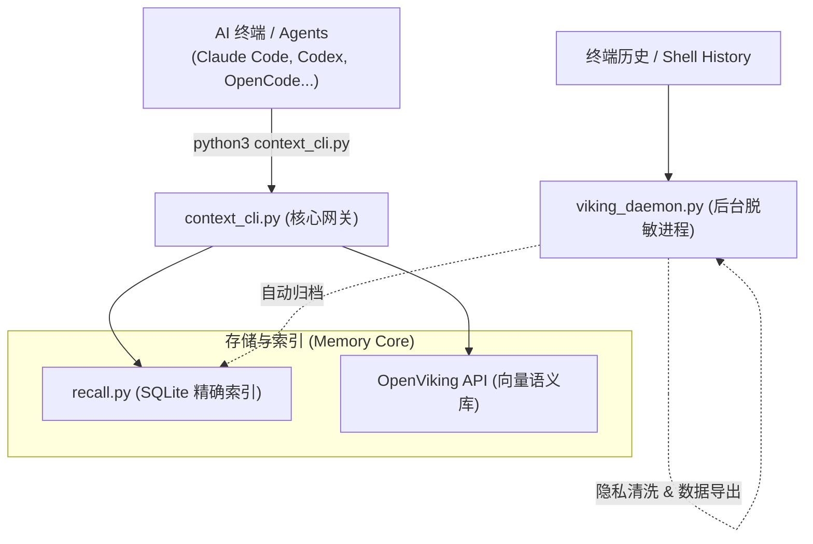
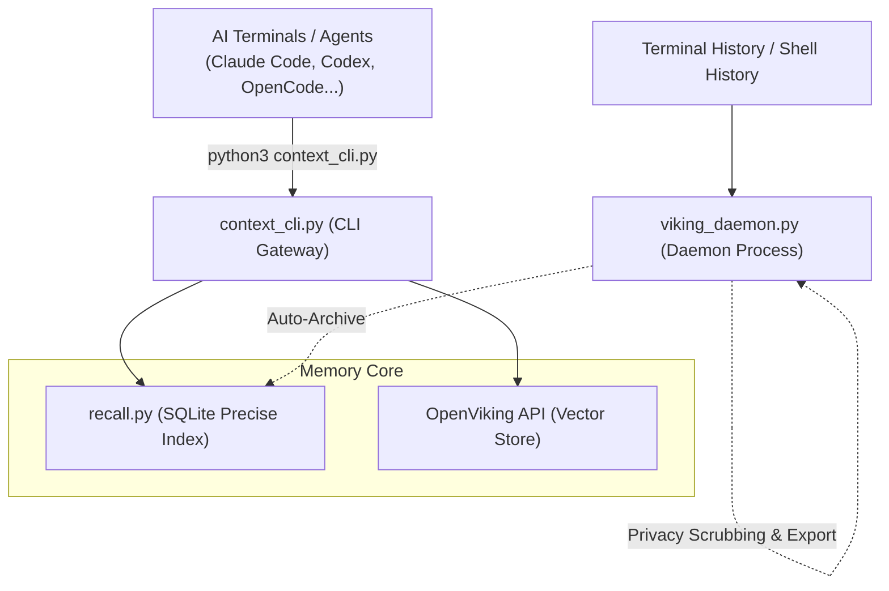

# Context Mesh Foundry

[中文版](#中文版) | [English](#english)

---

<a name="中文版"></a>
## 问题是什么

现代 AI 辅助开发会产生很多并行会话 — Claude Code、Codex CLI、OpenCode、终端 Shell… 每个都从零上下文开始。一个会话中的决策、调试历史和架构约束对下一个会话是不可见的，导致 AI 反复犯错或需要你重复重复喂背景。

## 这个项目做了什么

Context Mesh Foundry (CMF) 是一个**本地优先、无 MCP 依赖、零 Docker 运行**的上下文持久层。它将三个子系统缝合成统一的记忆网格：

1. **recall.py** — 跨所有 AI 会话历史的混合搜索（SQLite 索引 + 正则）
2. **context_cli.py** — 轻量 CLI，支持 search / semantic / save / health — **默认入口**
3. **viking_daemon.py** — 后台守护进程，监控终端/AI 历史并将清洗后的内容导出到本地存储。

### 🚀 零 Docker / 纯 Python 协议

与许多需要 Docker 运行复杂向量数据库（Milvus、Chroma）的上下文系统不同，CMF 设计为**服务器可选**：

- **默认模式**：完全作为本地 Python 脚本运行。使用本地 SQLite 索引和标准文件搜索。无需 Docker，无需后台服务器，无额外开销。
- **高级模式（可选）**：如果你已经在运行 [OpenViking](https://github.com/Open-Wise/OpenViking) 服务器，CMF 可以自动同步到服务器以支持高维语义搜索。但对于 90% 的场景，纯本地模式更快且足够好用。

### 三段式预热协议（强制执行）

每个 AI 会话在执行任务前，应遵循以下检索顺序：

```
1. Recall 精确检索       （必做，查找具体 session 或代码片段）
2. 本地语义检索          （仅 recall 未命中时，查找宽泛概念）
3. 代码库扫描            （最后手段，针对当前文件的定向扫描）
```

未经 recall 预热就做全盘穷举扫描（如 `rg` 扫 `~/` 或 `/Volumes/*`）是**被禁止的**。

## 系统架构

```text
┌─────────────────────────────────────────────┐
│              AI 终端 / Agent                 │
│     (Claude Code, Codex CLI, OpenCode…)     │
└──────────────┬──────────────────────────────┘
               │ 调用 python3 context_cli.py
               ▼
┌─────────────────────────────────────────────┐
│          context_cli.py (CLI 入口)           │
│ • search: recall.py → 本地文件扫描           │
│ • semantic: 语义匹配 (可选对接 OpenViking)   │
│ • save: 持久化保存关键决策与约束             │
│ • health: 全栈健康自检                       │
└──────────────┬──────────────────────────────┘
               │
       ┌───────┴───────┐
       ▼               ▼
┌────────────┐  ┌─────────────────┐
│  recall.py │  │  OpenViking API │
│  (SQLite   │  │  (可选向量引擎)   │
│   混合索引) │  │                 │
└────────────┘  └─────────────────┘
       ▲
       │ 空闲时自动归档
┌──────┴──────────────────────────────────────┐
│          viking_daemon.py (守护进程)         │
│ • 监控: Claude, Codex, OpenCode, Shell...  │
│ • 清洗: 15+ 种隐私/密钥脱敏模式              │
│ • 导出: 格式化 Markdown → 本地/远程存储      │
│ • 队列: 离线时自动存入 .pending/ 等待重试     │
└─────────────────────────────────────────────┘
```



### GSD 集成

与 [GSD 工作流](https://github.com/dunova/get-shit-done)（`discuss → plan → execute → verify`）配合使用时，每个阶段都会通过 `context_cli.py` 自动预热上下文：

- **discuss 阶段**: 强制执行 recall 检索历史。
- **plan 阶段**: 执行 recall 并可选补全语义背景。
- **health 阶段**: 通过 `context_healthcheck.sh` 监控系统运行状态。

## 模块地图

### 核心运行时 (Core Runtime)

| 脚本 | 用途 |
|--------|---------|
| `context_cli.py` | **默认 CLI 入口** — 负责搜索、语义查询、保存记忆和健康检查 |
| `viking_daemon.py` | 后台守护进程：实时监控 → 脱敏清洗 → 自动归档 |
| `openviking_mcp.py` | 旧版 MCP 兼容层 (保留作为参考，非默认路径) |
| `context_healthcheck.sh` | 针对整个上下文系统栈的全面健康检查 |
| `start_openviking.sh` | 安全启动 OpenViking 服务的脚本 (处理端口、配置、重试) |
| `unified_context_deploy.sh` | 部署工具：同步脚本、安装 launchd/systemd、自动重载 |
| `scf_context_prewarm.sh` | Shell 助手，用于在 GSD 动作执行前预热上下文 |

### 记忆管理 (Memory Tools)

| 脚本 | 用途 |
|--------|---------|
| `memory_index.py` | 本地记忆文件的索引、去重与元数据更新 |
| `memory_viewer.py` | 本地记忆浏览器，用于查看和搜索已存的上下文 |
| `memory_hit_first_regression.py` | 回归测试套件，验证检索命中的准确度 |
| `export_memories.py` | 将本地记忆导出为可迁移格式 |
| `import_memories.py` | 从备份导入历史记忆 |
| `start_memory_viewer.sh` | 启动记忆浏览器 |

### 上下文优先策略 (Context-First Policy)

| 脚本 | 用途 |
|--------|---------|
| `apply_context_first_policy.sh` | 将 "询问上下文优先" 协议写入 AI 终端配置 |
| `verify_context_first_policy.sh` | 验证各终端是否严格执行该检索协议 |
| `e2e_quality_gate.py` | 端到端质量门禁，监控整个流水线的数据完整性 |
| `test_context_cli.py` | `context_cli.py` 的单元测试 |

### 辅助工具 (Utilities)

| 脚本 | 用途 |
|--------|---------|
| `onecontext_maintenance.py` | OneContext (旧版) 数据维护工具 |
| `run_onecontext_maintenance.sh` | 上述工具的 Wrapper 脚本 |
| `patch_openviking_semantic_processor.py` | 针对 VLM 的可选静默补丁 |

## 系统要求

- Python 3.10+
- (可选) [OpenViking](https://github.com/Open-Wise/OpenViking) 服务器已启动
- macOS (launchd) 或 Linux (systemd)
- [recall.py](https://github.com/dunova/get-shit-done) (归属于 GSD 技能生态)

## 快速开始

### 1. 克隆仓库

```bash
git clone https://github.com/dunova/context-mesh-foundry.git
cd context-mesh-foundry
```

### 2. 环境配置

```bash
cp .env.example .env
# 编辑 .env — 设置 OPENVIKING_URL、存储路径等
```

### 3a. 部署 (macOS)

```bash
bash scripts/unified_context_deploy.sh
```

### 4. 验证运行状态

```bash
python3 scripts/context_cli.py health
```

### 5. 开始使用

```bash
# 跨所有 AI 终端历史进行精确搜索
python3 scripts/context_cli.py search "身份验证 bug" --type all --limit 20 --literal

# 语义检索
python3 scripts/context_cli.py semantic "数据库配置决策" --limit 5
```

## 守护进程工作原理

1. **自动发现**: 扫描 Claude Code、Codex、OpenCode、Kilo 以及普通的 Shell 历史 (zsh/bash)。
2. **实时增量读取**: 使用 inode 感知的游标检测文件新增行、轮转或截断。
3. **脱敏清洗**: 自动剔除 API 密钥、Token、密码、AWS 密钥、Slack 令牌和 PEM 私钥块。
4. **延迟自动归档**: 空闲 5 分钟后自动生成 Markdown 摘要并存入本地存储。
5. **重试机制**: 服务器离线时自动存入 `.pending/` 等待后续补录。
6. **自适应能效**: 智能调节扫描频率，静默期（如夜间）自动降频。

## 目录结构

```
context-mesh-foundry/
├── scripts/
│   ├── context_cli.py                # 默认 CLI 入口
│   ├── viking_daemon.py              # 后台守护进程
│   ├── ...                           # 其他子工具
├── templates/
│   ├── launchd/                      # macOS 服务模板
│   └── systemd-user/                 # Linux 服务模板
├── ...
└── .env.example                      # 环境变量模板
```

## 安全与隐私

守护进程在本地通过正则表达式强行拦截并剔除 API 密钥、密码、私钥等 15 种敏感信息。数据目录默认为 `chmod 700`，生成的 Markdown 记忆文件为 `chmod 600`。

## 环境变量

具体配置项见 [`.env.example`](.env.example)。

## 许可证

[GPL-3.0](LICENSE)

---

<a name="english"></a>
## The Problem

Modern AI-assisted development spawns many parallel sessions — Claude Code, Codex CLI, OpenCode, terminal shells… Each starts with zero context. Decisions, debugging history, and architectural constraints from one session are invisible to the next, causing AI to hallucinate or require redundant prompting.

## What This Does

Context Mesh Foundry (CMF) is a **local-first, MCP-free, and Zero-Docker** context persistence layer. It weaves together three subsystems into a unified memory mesh:

1. **recall.py** — Hybrid search across all AI session histories (SQLite index + regex)
2. **context_cli.py** — Lightweight CLI for search, semantic query, save, and health check — the **default entry point**
3. **viking_daemon.py** — Background daemon that watches terminal/AI histories and exports sanitized markdown to local storage.

### 🚀 Zero-Docker / Pure-Python Operation

Unlike many context systems that require complex vector databases (Milvus, Chroma) running in Docker, CMF is designed to be **server-optional**:

- **Default Mode**: Operates entirely as local Python scripts. It uses a local SQLite index and standard file search. No Docker, no background servers, no overhead.
- **Advanced Mode (Optional)**: If you already have [OpenViking](https://github.com/Open-Wise/OpenViking) running, CMF can automatically sync to it for high-dimensional semantic search. But for 90% of use cases, the local-only mode is faster and sufficient.

### Hit-First Retrieval Protocol

Every AI session should follow this order before doing any work:

```
1. Recall exact search   (mandatory: check specific sessions or snippets)
2. Local semantic search  (only if recall misses: check broad concepts)
3. Codebase scan          (only as last resort: targeted local scan)
```

Blind whole-disk scans (`~/`, `/Volumes/*`) without prior recall are **forbidden**.

## Architecture

```text
┌─────────────────────────────────────────────┐
│              AI Terminals / Agents           │
│     (Claude Code, Codex CLI, OpenCode…)     │
└──────────────┬──────────────────────────────┘
               │ call python3 context_cli.py
               ▼
┌─────────────────────────────────────────────┐
│          context_cli.py (CLI Gateway)       │
│ • search: recall.py → Local File Scan       │
│ • semantic: Semantic match (OpenViking opt) │
│ • save: Persist key decisions / constraints │
│ • health: Full-stack health check           │
└──────────────┬──────────────────────────────┘
               │
       ┌───────┴───────┐
       ▼               ▼
┌────────────┐  ┌─────────────────┐
│  recall.py │  │  OpenViking API │
│  (SQLite   │  │  (vectorized    │
│   hybrid)  │  │   search)       │
└────────────┘  └─────────────────┘
       ▲
       │  auto-export on idle
┌──────┴──────────────────────────────────────┐
│           viking_daemon.py (Daemon)         │
│   • Watches: Claude, Codex, OpenCode,       │
│     Kilo, zsh/bash, Gemini walkthroughs     │
│   • Sanitizes: 15+ redaction patterns       │
│   • Exports: markdown → local storage       │
│   • Queues failures to .pending/            │
└─────────────────────────────────────────────┘
```



### GSD Integration

When used with the [GSD workflow](https://github.com/dunova/get-shit-done) (`discuss → plan → execute → verify`), each phase auto-preheats context via `context_cli.py`:

- **discuss-phase**: mandatory recall search
- **plan-phase**: recall + optional semantic backfill
- **health**: stack-wide diagnostics via `context_healthcheck.sh`

## Module Map

### Core Runtime

| Script | Purpose |
|--------|---------|
| `context_cli.py` | **Default CLI entry point** — search, semantic, save, health |
| `viking_daemon.py` | Background daemon: watch → sanitize → export |
| `openviking_mcp.py` | Legacy MCP bridge (kept for reference, not the default path) |
| `context_healthcheck.sh` | Comprehensive health checks for the whole stack |
| `start_openviking.sh` | Start OpenViking safely (ports, config, retries) |
| `unified_context_deploy.sh` | Deploy: sync scripts/skills, patch launchd, reload |
| `scf_context_prewarm.sh` | Shell helper for context warmup before GSD actions |

### Memory Tools

| Script | Purpose |
|--------|---------|
| `memory_index.py` | Local memory indexing and deduplication |
| `memory_viewer.py` | Browse and inspect stored memories |
| `memory_hit_first_regression.py` | Regression suite for retrieval quality |
| `export_memories.py` | Export memories to portable format |
| `import_memories.py` | Import memories from backup |
| `start_memory_viewer.sh` | Launch memory viewer |

### Context-First Policy

| Script | Purpose |
|--------|---------|
| `apply_context_first_policy.sh` | Apply Context-First protocol to AI tool configs |
| `verify_context_first_policy.sh` | Verify all terminals follow the protocol |
| `e2e_quality_gate.py` | End-to-end quality gate for context pipeline |
| `test_context_cli.py` | Unit tests for context_cli.py |

### Utilities

| Script | Purpose |
|--------|---------|
| `onecontext_maintenance.py` | OneContext data maintenance |
| `run_onecontext_maintenance.sh` | Wrapper for above |
| `patch_openviking_semantic_processor.py` | Optional VLM quiet patch |

## Requirements

- Python 3.10+
- (Optional) [OpenViking](https://github.com/Open-Wise/OpenViking) server
- macOS (launchd) or Linux (systemd)
- [recall.py](https://github.com/dunova/get-shit-done) (from GSD skills)

## Quick Start

### 1. Clone

```bash
git clone https://github.com/dunova/context-mesh-foundry.git
cd context-mesh-foundry
```

### 2. Configure

```bash
cp .env.example .env
# Edit .env — set OPENVIKING_URL, storage paths
```

### 3a. Deploy (macOS)

```bash
bash scripts/unified_context_deploy.sh
```

### 4. Verify

```bash
python3 scripts/context_cli.py health
```

### 5. Use

```bash
# Search across all AI session histories
python3 scripts/context_cli.py search "authentication bug" --type all --limit 20 --literal

# Semantic search
python3 scripts/context_cli.py semantic "database decisions" --limit 5
```

## How the Daemon Works

1. **Auto-Discovery**: Scans Claude, Codex CLI, OpenCode, Kilo, and Shells (zsh/bash).
2. **Inode Tracking**: Efficiently tails files even if rotated or truncated.
3. **Privacy Scrubbing**: Uses 15+ regex patterns to redact API keys, tokens, and passwords.
4. **Idle Archival**: Automatically exports summaries to local storage after 5m idle.
5. **Fail-safe Queuing**: Retries failed remote exports via `.pending/` directory.
6. **Adaptive Polling**: Saves CPU by throttling when idle or at night.

## Repository Layout

```
context-mesh-foundry/
├── scripts/
│   ├── context_cli.py                # Default CLI entry point
│   ├── viking_daemon.py              # Background daemon
│   ├── openviking_mcp.py             # Legacy MCP bridge
│   ├── context_healthcheck.sh        # Health checks
│   ├── unified_context_deploy.sh     # Deploy & sync
│   ├── ...
├── templates/
│   ├── launchd/                      # macOS plists
│   └── systemd-user/                 # Linux services
├── ...
└── .env.example                      # ENV template
```

## Security

Scans for secrets on push and redacts sensitive data (API keys, tokens, AWS keys) before archival. Data directories use strict `chmod 700` permissions.

## Environment Variables

See [`.env.example`](.env.example) for all configurable variables.

## License

[GPL-3.0](LICENSE)
