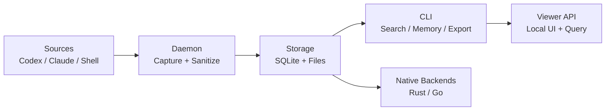
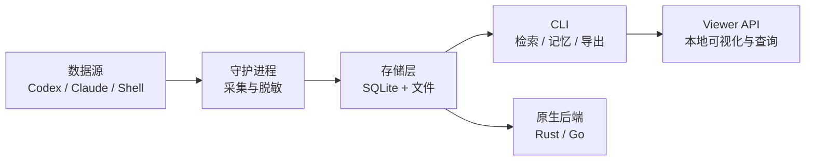

<p align="center">
  
</p>

**Local-first context and memory runtime for multi-agent AI coding teams.**

**面向多 Agent AI 编码团队的本地优先上下文与记忆运行时。**

```
pip install contextgo
```

---

[](https://github.com/dunova/ContextGO/actions/workflows/verify.yml)
[](https://codecov.io/gh/dunova/ContextGO)
[](https://github.com/dunova/ContextGO/releases/tag/v0.7.0)
[](https://github.com/dunova/ContextGO/blob/main/LICENSE)
[](https://www.python.org/)
[](#quick-start)

---

## What is ContextGO?

ContextGO unifies Codex, Claude, and shell session histories into one **searchable, auditable index** stored entirely on your machine. It is built for developers and teams running multiple AI coding agents in parallel who need **persistent cross-session memory without cloud dependencies**. No Docker, no MCP broker, no external vector database — clone, deploy, and run in under five minutes.

---

## Why ContextGO?

- **Local-first privacy.** All session data stays on your machine. Nothing leaves your trust boundary unless you explicitly configure remote sync.
- **Zero infrastructure.** No Docker. No MCP. No external vector store. Runs on a bare machine from a single deploy script.
- **Multi-agent session index.** One searchable index across Codex, Claude, and shell histories running in parallel.
- **Rust and Go hot paths.** Python owns the stable control plane; Rust and Go replace only the measured bottlenecks, delivering native scan speed with no full-stack rewrite.
- **Delivery validation built in.** `health`, `smoke`, and `benchmark` are first-class commands shipped in the same binary, not afterthoughts.

---

## Install

**Option 1 — pip (recommended)**

```bash
pip install contextgo
contextgo health
```

**Option 2 — manual**

```bash
git clone https://github.com/dunova/ContextGO.git
cd ContextGO
bash scripts/unified_context_deploy.sh
python3 scripts/context_cli.py health
```

---

## Architecture



---

## Quick Start

```bash
# 1. Verify the installation
contextgo health

# 2. Run the full smoke test suite
contextgo smoke

# 3. Search across all indexed sessions
contextgo search "auth root cause" --limit 10

# 4. Semantic search using local embeddings
contextgo semantic "database design decision" --limit 5

# 5. Start the local viewer
contextgo serve --host 127.0.0.1 --port 37677
```

---

## Core Commands

### Search

| Command | Description | Example |
|---|---|---|
| `search QUERY` | Full-text keyword search across all indexed sessions | `contextgo search "schema migration" --limit 10` |
| `semantic QUERY` | Semantic similarity search using local embeddings | `contextgo semantic "database design decision" --limit 5` |
| `native-scan` | Invoke the Rust or Go scanner directly | `contextgo native-scan --backend auto --threads 4` |

### Memory

| Command | Description | Example |
|---|---|---|
| `save` | Save a titled memory entry with optional tags | `contextgo save --title "Auth fix" --content "..." --tags auth,bug` |
| `export` | Export indexed entries to a JSON file | `contextgo export "" /tmp/export.json --limit 1000` |
| `import` | Import a previously exported JSON file | `contextgo import /tmp/export.json` |

### Server

| Command | Description | Example |
|---|---|---|
| `serve` | Start the local viewer API server | `contextgo serve --host 127.0.0.1 --port 37677` |

### Maintenance and Validation

| Command | Description | Example |
|---|---|---|
| `health` | Check installation state and storage integrity | `contextgo health` |
| `smoke` | Run the full smoke test suite against a working copy | `contextgo smoke` |
| `maintain` | Run cleanup and repair on the local index | `contextgo maintain --dry-run` |

---

## For AI Agents

If you are an AI agent (Claude, Codex, Cursor, or any LLM-powered tool), see [AGENTS.md](AGENTS.md) for a complete onboarding guide. To auto-install and verify in one command:

```bash
git clone https://github.com/dunova/ContextGO.git && cd ContextGO && bash scripts/unified_context_deploy.sh && python3 scripts/context_cli.py smoke
```

---

## Comparison

| Feature | ContextGO | Cursor Context | Continue.dev | Mem0 |
|---|---|---|---|---|
| Local-first by default | Yes | Partial | Partial | No |
| Docker-free | Yes | Yes | Partial | No |
| Multi-agent session index | Yes | No | No | Partial |
| Native Rust/Go scan | Yes | No | No | No |
| MCP-free by default | Yes | No | No | No |
| Built-in delivery validation | Yes | No | No | No |

---

## Performance

- **Rust scanner** (`native/session_scan/`) delivers low-allocation file scanning on large directory trees with explicit error handling on every path operation.
- **Go parallel scanner** (`native/session_scan_go/`) uses concurrent directory walks and byte-slice snippet extraction to minimize heap allocations per result.
- **SQLite FTS5** full-text index uses batched writes (per-100-row commit) that reduce write amplification by approximately 80% compared to per-row commits on large ingest loads.

---

## Project Structure

```text
ContextGO/
├── docs/                      # Architecture, release notes, troubleshooting
├── scripts/                   # Unified control plane
│   ├── context_cli.py         # Single operator entry point for all commands
│   ├── context_daemon.py      # Session capture and sanitization
│   ├── session_index.py       # SQLite-backed session index and retrieval
│   ├── memory_index.py        # Memory and observation index
│   ├── context_server.py      # Local viewer API server
│   ├── context_maintenance.py # Index cleanup and repair
│   ├── context_smoke.py       # Working-copy smoke tests
│   └── unified_context_deploy.sh
├── native/
│   ├── session_scan/          # Rust hot path for file scanning
│   └── session_scan_go/       # Go hot path for parallel scanning
├── benchmarks/                # Python vs. native-wrapper performance harness
├── templates/                 # launchd and systemd-user service templates
└── examples/                  # Configuration examples
```

---

## Contributing, Security, and License

- [CONTRIBUTING.md](CONTRIBUTING.md) — local development setup, test execution, PR quality gate
- [SECURITY.md](SECURITY.md) — threat model, trust boundary, responsible disclosure
- [CHANGELOG.md](CHANGELOG.md) — full version history
- [docs/ARCHITECTURE.md](docs/ARCHITECTURE.md) — component breakdown, data flow, design principles
- [docs/TROUBLESHOOTING.md](docs/TROUBLESHOOTING.md) — common failure modes and resolution steps
- [AGENTS.md](AGENTS.md) — AI agent onboarding guide

Licensed under [AGPL-3.0](LICENSE).

---

---

# 中文版

## ContextGO 是什么？

ContextGO 将 Codex、Claude 和 shell 的会话历史统一到一条**可检索、可追溯的索引**中，所有数据存储在本机。它为同时运行多个 AI 编码 agent 的开发者和团队提供**无云依赖的跨会话持久记忆**。无需 Docker，无需 MCP 代理，无需外部向量数据库——在一台裸机上克隆、部署、运行，五分钟内可完成。

---

## 为什么选择 ContextGO？

- **本地优先的隐私保障。** 所有会话数据默认留在本机，上下文不会离开你的信任边界，除非你主动配置远程同步。
- **零基础设施依赖。** 无 Docker，无 MCP，无外部向量存储。单脚本部署，在裸机上即可运行。
- **多 Agent 统一索引。** Codex、Claude、shell agent 并行运行时，所有历史共用一个可检索的统一索引。
- **Rust 与 Go 热路径加速。** Python 负责稳定的控制层；Rust 与 Go 只替换经基准测试确认的瓶颈，无需重写整套工作流。
- **交付验证内置。** `health`、`smoke`、`benchmark` 是与主命令同级的一等命令，不是事后附加的附件。

---

## 安装

**方式一 — pip（推荐）**

```bash
pip install contextgo
contextgo health
```

**方式二 — 手动**

```bash
git clone https://github.com/dunova/ContextGO.git
cd ContextGO
bash scripts/unified_context_deploy.sh
python3 scripts/context_cli.py health
```

---

## 架构图



---

## 快速上手

```bash
# 1. 验证安装状态
contextgo health

# 2. 执行完整 smoke 测试套件
contextgo smoke

# 3. 在所有已索引会话中检索
contextgo search "认证根因" --limit 10

# 4. 使用本地向量执行语义检索
contextgo semantic "数据库设计决策" --limit 5

# 5. 启动本地 Viewer
contextgo serve --host 127.0.0.1 --port 37677
```

---

## 核心命令

### 检索

| 命令 | 说明 | 示例 |
|---|---|---|
| `search QUERY` | 对所有已索引会话执行全文关键词检索 | `contextgo search "schema 迁移" --limit 10` |
| `semantic QUERY` | 使用本地向量执行语义相似度检索 | `contextgo semantic "数据库设计决策" --limit 5` |
| `native-scan` | 直接调用 Rust 或 Go 原生扫描器 | `contextgo native-scan --backend auto --threads 4` |

### 记忆

| 命令 | 说明 | 示例 |
|---|---|---|
| `save` | 保存一条带标题和标签的记忆条目 | `contextgo save --title "认证修复" --content "..." --tags auth,bug` |
| `export` | 将已索引条目导出为 JSON 文件 | `contextgo export "" /tmp/export.json --limit 1000` |
| `import` | 导入之前导出的 JSON 文件 | `contextgo import /tmp/export.json` |

### 服务

| 命令 | 说明 | 示例 |
|---|---|---|
| `serve` | 启动本地 Viewer API 服务 | `contextgo serve --host 127.0.0.1 --port 37677` |

### 维护与验证

| 命令 | 说明 | 示例 |
|---|---|---|
| `health` | 检查安装状态与存储完整性 | `contextgo health` |
| `smoke` | 对工作副本执行完整 smoke 测试套件 | `contextgo smoke` |
| `maintain` | 对本地索引执行清理与修复 | `contextgo maintain --dry-run` |

---

## 面向 AI Agent

如果你是 AI agent（Claude、Codex、Cursor 或任何 LLM 驱动的工具），请参阅 [AGENTS.md](AGENTS.md) 获取完整接入指南。一键自动安装并验证：

```bash
git clone https://github.com/dunova/ContextGO.git && cd ContextGO && bash scripts/unified_context_deploy.sh && python3 scripts/context_cli.py smoke
```

---

## 对比

| 特性 | ContextGO | Cursor Context | Continue.dev | Mem0 |
|---|---|---|---|---|
| 默认本地优先 | 是 | 部分 | 部分 | 否 |
| 无需 Docker | 是 | 是 | 部分 | 否 |
| 多 Agent 会话索引 | 是 | 否 | 否 | 部分 |
| Rust/Go 原生扫描 | 是 | 否 | 否 | 否 |
| 默认无 MCP | 是 | 否 | 否 | 否 |
| 内置交付验证链 | 是 | 否 | 否 | 否 |

---

## 性能

- **Rust 扫描器**（`native/session_scan/`）在大型目录树上实现低分配文件扫描，所有路径操作均有显式错误处理。
- **Go 并行扫描器**（`native/session_scan_go/`）使用并发目录遍历和字节切片 snippet 提取，最大限度减少每条结果的堆分配。
- **SQLite FTS5** 全文检索索引采用批量写入（每 100 行提交一次），相比逐行提交可将大批量入库时的写放大降低约 80%。

---

## 目录结构

```text
ContextGO/
├── docs/                      # 架构、发布说明、故障排查
├── scripts/                   # 统一控制层
│   ├── context_cli.py         # 所有命令的唯一操作入口
│   ├── context_daemon.py      # 会话采集与脱敏写盘
│   ├── session_index.py       # SQLite 会话索引与检索排序
│   ├── memory_index.py        # 记忆与 observation 索引
│   ├── context_server.py      # 本地 Viewer API 服务
│   ├── context_maintenance.py # 索引清理与修复
│   ├── context_smoke.py       # 工作副本 smoke 测试
│   └── unified_context_deploy.sh
├── native/
│   ├── session_scan/          # Rust 文件扫描热路径
│   └── session_scan_go/       # Go 并行扫描热路径
├── benchmarks/                # Python 与 native-wrapper 性能基准
├── templates/                 # launchd / systemd-user 服务模板
└── examples/                  # 配置样例
```

---

## 参与贡献、安全与许可证

- [CONTRIBUTING.md](CONTRIBUTING.md) — 本地开发环境搭建、测试执行、PR 质量门标准
- [SECURITY.md](SECURITY.md) — 威胁模型、信任边界、负责任披露指南
- [CHANGELOG.md](CHANGELOG.md) — 完整版本变更记录
- [docs/ARCHITECTURE.md](docs/ARCHITECTURE.md) — 组件概览、数据流、设计原则
- [docs/TROUBLESHOOTING.md](docs/TROUBLESHOOTING.md) — 常见故障与排查步骤
- [AGENTS.md](AGENTS.md) — AI agent 接入指南

许可证：[AGPL-3.0](LICENSE)。
