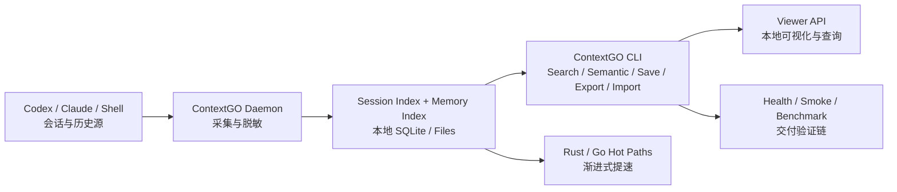

# ContextGO

[](https://github.com/dunova/ContextGO/stargazers)
[](https://github.com/dunova/ContextGO/actions/workflows/verify.yml)
[](https://github.com/dunova/ContextGO/releases)
[](https://github.com/dunova/ContextGO/blob/main/LICENSE)
[](https://github.com/dunova/ContextGO/commits/main)


## 中文版

把多 agent 团队的上下文、记忆、检索和验证链路收进一个本地优先、可回滚、可交付的运行时。

如果你也在做 Codex / Claude / shell 协作，而且你需要一套本地优先、可回滚、可交付的上下文底座，先点个 `star`，等你真正要接这条链时能直接找回它。

### 它解决什么

很多团队已经有很多 agent，但没有一条统一、可信、可运维的上下文主链。

ContextGO 主要解决四件事：

- 把 Codex、Claude、shell、本地记忆统一检索
- 让 `health / smoke / benchmark` 成为默认交付链路
- 让数据默认留在本机，而不是先依赖云向量层
- 让 Rust / Go 提速挂在同一 CLI 下渐进落地

### 为什么值得收藏

- 不是 demo：自带 `health / smoke / benchmark / installed-runtime` 闭环
- 不是壳层：默认无 MCP、无 Docker、无外部桥接前置
- 不是一次性重写：Python 主链稳定交付，Rust / Go 只替换热点
- 不是“更智能优先”：先把命中率、可追溯性、可回滚性做好

### 适用对象

适合：

- 多 agent AI 编码团队
- 本地优先、数据边界敏感的研发组织
- 希望把“上下文系统”做成可交付内部产品的团队
- 想提速，但不想重写整套工作流的团队

不适合：

- 只需要一个简单聊天记录查看器的场景
- 默认接受云记忆 / 云向量 / 中心化编排的团队
- 不需要本地部署、不关心 `health/smoke` 的场景

### 架构图



### 架构树

```text
ContextGO/
├── docs/                      # 架构、发布、故障排查、商业交付文档
├── scripts/                   # 单体主链：CLI / daemon / server / smoke / health / deploy
│   ├── context_cli.py         # 唯一入口：search / semantic / save / serve / smoke
│   ├── context_daemon.py      # 会话采集、脱敏、写盘
│   ├── session_index.py       # 会话索引与检索排序
│   ├── memory_index.py        # 记忆 / observation 索引
│   ├── context_server.py      # viewer 服务入口
│   ├── context_maintenance.py # 清理与维护
│   ├── context_smoke.py       # 工作副本 smoke
│   ├── context_healthcheck.sh # 安装态 / 本地健康检查
│   └── unified_context_deploy.sh
├── native/
│   ├── session_scan/          # Rust 热路径
│   └── session_scan_go/       # Go 热路径
├── benchmarks/                # Python / native-wrapper 基准
├── integrations/gsd/          # GSD / gstack 工作流接入
├── artifacts/                 # autoresearch 结果、测试集、QA 报告
├── templates/                 # launchd / systemd-user 模板
├── examples/                  # 配置模板
└── patches/                   # 兼容补丁说明
```

更详细的架构说明见 [docs/ARCHITECTURE.md](docs/ARCHITECTURE.md)。

### 信任块

- 默认运行链路：`local-first / MCP-free / Docker-free`
- 当前高分基线：`autoresearch = 99.0`
- 当前关键体积指标：
  - `health_bytes = 386`
  - `smoke_bytes = 346`
  - `search_bytes = 1417`
  - `native_total_bytes = 4382`
- 当前最佳轮次快照：
  - [artifacts/autoresearch/contextgo_autoresearch_best.json](artifacts/autoresearch/contextgo_autoresearch_best.json)

### 产品预览

#### CLI 检索预览


#### Viewer 预览


更多截图规范见 [docs/MEDIA_GUIDE.md](docs/MEDIA_GUIDE.md)。

### 10 分钟上手

```bash
git clone https://github.com/dunova/ContextGO.git
cd ContextGO
bash scripts/unified_context_deploy.sh
python3 scripts/context_cli.py health
python3 scripts/context_cli.py smoke
```

如果你只想先确认“它到底能不能跑”，直接执行：

```bash
python3 scripts/context_cli.py health
python3 scripts/context_cli.py smoke
```

### 核心命令

```bash
python3 scripts/context_cli.py search "auth root cause" --limit 10 --literal
python3 scripts/context_cli.py semantic "数据库 schema 决策" --limit 5
python3 scripts/context_cli.py save --title "Auth fix" --content "..." --tags auth,bug
python3 scripts/context_cli.py export "" /tmp/contextgo-export.json --limit 1000
python3 scripts/context_cli.py import /tmp/contextgo-export.json
python3 scripts/context_cli.py serve --host 127.0.0.1 --port 37677
python3 scripts/context_cli.py maintain --dry-run
python3 scripts/context_cli.py health
python3 scripts/context_cli.py smoke
python3 scripts/context_cli.py native-scan --backend auto --threads 4
```

### 为什么不是 MCP / 云记忆 / 云向量路线

| 对比项 | ContextGO | 典型 MCP / 云记忆方案 |
|---|---|---|
| 默认依赖 | 本地文件系统 + SQLite | 外部服务 / 桥接层 / 远程 API |
| 数据边界 | 默认留在本机 | 经常要把上下文送出本地 |
| 运维复杂度 | 单体部署 + 本地验证 | 多进程、多服务、多连接点 |
| 故障定位 | `health + smoke + benchmark` 一条链 | 常分散在桥接与外部状态 |
| 提速路径 | 渐进式 Rust/Go 热点替换 | 常常需要改接口或改运行方式 |
| 目标用户 | 真正在交付内部工具的团队 | 更偏实验集成与演示编排 |

### 验证矩阵

```bash
bash -n scripts/*.sh
python3 -m py_compile scripts/*.py benchmarks/*.py
python3 -m pytest scripts/test_context_cli.py scripts/test_context_core.py scripts/test_context_native.py scripts/test_context_smoke.py scripts/test_session_index.py scripts/test_autoresearch_contextgo.py
python3 scripts/e2e_quality_gate.py
python3 scripts/context_cli.py health
python3 scripts/context_cli.py smoke
python3 scripts/smoke_installed_runtime.py
cd native/session_scan_go && go test ./...
cd native/session_scan && CARGO_INCREMENTAL=0 cargo test
python3 -m benchmarks --mode both --iterations 1 --warmup 0 --query benchmark --format text
```

### 性能路线

ContextGO 不是“全面重写”，而是“热点替换”：

1. 先把 Python 主链做到最稳
2. 用 benchmark 找出瓶颈
3. 只把热点挪到 Rust / Go
4. 用户侧继续只面对同一套 `context_cli.py`

### 相关文档

- [docs/ARCHITECTURE.md](docs/ARCHITECTURE.md)
- [docs/MEDIA_GUIDE.md](docs/MEDIA_GUIDE.md)
- [docs/RELEASE_NOTES_0.7.0.md](docs/RELEASE_NOTES_0.7.0.md)
- [docs/LAUNCH_COPY.md](docs/LAUNCH_COPY.md)
- [docs/TROUBLESHOOTING.md](docs/TROUBLESHOOTING.md)

### FAQ

#### 它是库还是产品？

首先是产品，其次才是代码仓库。

#### 它是否依赖 MCP？

默认不依赖。当前主链是 MCP-free。

#### 它是否必须接远程服务？

不需要。默认完全本地。

#### 它是否必须接向量数据库或向量 API？

默认不需要。只有在你要做跨语义、低关键词重合、超长文本弱召回时，才值得评估可选向量层。

## English Version

ContextGO is a local-first context and memory runtime for multi-agent AI coding teams.

If your team works across Codex, Claude, shell, and local memory files, ContextGO gives you one auditable, searchable, rollback-friendly runtime instead of another bridge stack.

### What It Solves

- unifies Codex, Claude, shell, and local memory into one searchable chain
- makes `health / smoke / benchmark` part of the default delivery workflow
- keeps data local by default
- upgrades hot paths with Rust / Go without changing operator workflows

### Why It Gets Stars

- not a demo: ships with health, smoke, benchmark, and installed-runtime validation
- not another wrapper stack: MCP-free, Docker-free, no external bridge required by default
- not a rewrite-first project: Python stays the stable control plane, Rust/Go replace only hotspots
- not “AI magic first”: trust, recall quality, and operational clarity come first

### Best Fit

- multi-agent AI coding teams
- local-first engineering organizations
- private internal memory/runtime tooling
- teams that want gradual acceleration without rebuilding everything

### Architecture

See the diagram above and the full breakdown in [docs/ARCHITECTURE.md](docs/ARCHITECTURE.md).

### Quick Start

```bash
git clone https://github.com/dunova/ContextGO.git
cd ContextGO
bash scripts/unified_context_deploy.sh
python3 scripts/context_cli.py health
python3 scripts/context_cli.py smoke
```

### Core Commands

```bash
python3 scripts/context_cli.py search "auth root cause" --limit 10 --literal
python3 scripts/context_cli.py semantic "schema decision" --limit 5
python3 scripts/context_cli.py health
python3 scripts/context_cli.py smoke
python3 scripts/context_cli.py native-scan --backend auto --threads 4
```

### Why Not MCP / Cloud Memory

ContextGO favors:

- local trust boundaries
- one CLI
- one validation chain
- gradual Rust/Go acceleration
- lower token cost through exact search and compact snippets

### Validation

```bash
python3 scripts/context_cli.py health
python3 scripts/context_cli.py smoke
python3 scripts/smoke_installed_runtime.py
cd native/session_scan_go && go test ./...
cd native/session_scan && CARGO_INCREMENTAL=0 cargo test
```

### Launch Assets

- [docs/ARCHITECTURE.md](docs/ARCHITECTURE.md)
- [docs/MEDIA_GUIDE.md](docs/MEDIA_GUIDE.md)
- [docs/LAUNCH_COPY.md](docs/LAUNCH_COPY.md)
- [docs/RELEASE_NOTES_0.7.0.md](docs/RELEASE_NOTES_0.7.0.md)

### Version

- Current version: `0.7.0`
- Release notes: [docs/RELEASE_NOTES_0.7.0.md](docs/RELEASE_NOTES_0.7.0.md)
- Changelog: [CHANGELOG.md](CHANGELOG.md)
