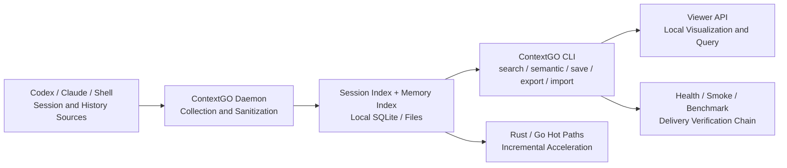

# ContextGO

**Local-first context and memory runtime for AI coding teams.**
本地优先的多 Agent 上下文与记忆运行时。

[](https://github.com/dunova/ContextGO/actions/workflows/verify.yml)
[](https://github.com/dunova/ContextGO/releases)
[](https://github.com/dunova/ContextGO/blob/main/LICENSE)
[](https://github.com/dunova/ContextGO/stargazers)
[](https://github.com/dunova/ContextGO/commits/main)
[](https://www.python.org/)
[](https://github.com/dunova/ContextGO)


---

## What is ContextGO?

ContextGO is a local-first context and memory runtime for multi-agent AI coding teams. It unifies session history, semantic memory, search, and delivery verification into a single CLI — no MCP bridge, no Docker, no external API required by default.

The core runtime is Python with Rust and Go hot paths for performance-critical operations. Data stays on your machine. The same `context_cli.py` entry point covers search, save, export, health checks, benchmarks, and the local viewer.

---

## Features

- **Unified retrieval** — search across Codex, Claude, and shell session history with both keyword and semantic modes
- **Local-first storage** — SQLite and local files; no cloud vector layer required by default
- **MCP-free and Docker-free** — no external bridges or containers needed to run the default chain
- **Health and smoke as first-class operations** — `health`, `smoke`, and `benchmark` are built into the delivery workflow, not bolted on
- **Incremental native acceleration** — Rust and Go hot paths replace only the bottlenecks; the user-facing CLI stays stable
- **Rollback-ready** — context state is local and exportable; import/export is a core command, not an afterthought
- **Single entry point** — everything runs through `scripts/context_cli.py`

---

## Architecture



### Repository Layout

```
ContextGO/
├── scripts/                        # Core runtime: CLI, daemon, server, smoke, health, deploy
│   ├── context_cli.py              # Single entry point: search / semantic / save / serve / smoke
│   ├── context_daemon.py           # Session collection, sanitization, and write
│   ├── session_index.py            # Session indexing and ranked retrieval
│   ├── memory_index.py             # Memory and observation indexing
│   ├── context_server.py           # Viewer server entry point
│   ├── context_maintenance.py      # Cleanup and maintenance operations
│   ├── context_smoke.py            # Working-copy smoke test
│   ├── context_healthcheck.sh      # Installation and local health check
│   └── unified_context_deploy.sh   # Deployment script
├── native/
│   ├── session_scan/               # Rust hot path
│   └── session_scan_go/            # Go hot path
├── benchmarks/                     # Python and native-wrapper benchmarks
├── docs/                           # Architecture, release notes, troubleshooting
├── integrations/gsd/               # GSD / gstack workflow integration
├── artifacts/                      # Autoresearch results, test sets, QA reports
├── templates/                      # launchd and systemd-user templates
├── examples/                       # Configuration templates
└── patches/                        # Compatibility patch notes
```

See [ARCHITECTURE.md](docs/ARCHITECTURE.md) for a detailed breakdown of each component.

---

## Quick Start

Get running in under 60 seconds:

```bash
# 1. Clone the repository
git clone https://github.com/dunova/ContextGO.git
cd ContextGO

# 2. Run the deploy script (sets up storage, indexes, and installs the runtime)
bash scripts/unified_context_deploy.sh

# 3. Verify the installation
python3 scripts/context_cli.py health
python3 scripts/context_cli.py smoke
```

If both commands exit cleanly, ContextGO is ready.

---

## Installation

**Requirements:**
- Python 3.9+
- macOS or Linux
- Rust toolchain (optional, for native session scan acceleration)
- Go 1.21+ (optional, for Go hot path)

**Storage root** defaults to `~/.contextgo`. Override with:

```bash
export CONTEXTGO_STORAGE_ROOT=/path/to/your/data
```

**Installed runtime root** defaults to `~/.local/share/contextgo/scripts`. Override with:

```bash
export CONTEXTGO_INSTALL_ROOT=/path/to/install
```

---

## Commands

All commands run through `python3 scripts/context_cli.py`.

### Search and Retrieval

```bash
# Keyword search across session history
python3 scripts/context_cli.py search "auth root cause" --limit 10 --literal

# Semantic search (no exact keyword match required)
python3 scripts/context_cli.py semantic "database schema decision" --limit 5

# Scan sessions using native backend
python3 scripts/context_cli.py native-scan --backend auto --threads 4
```

### Save and Manage Memory

```bash
# Save a memory entry
python3 scripts/context_cli.py save --title "Auth fix" --content "..." --tags auth,bug

# Export context to file
python3 scripts/context_cli.py export "" /tmp/contextgo-export.json --limit 1000

# Import context from file
python3 scripts/context_cli.py import /tmp/contextgo-export.json
```

### Serve and View

```bash
# Start the local viewer server
python3 scripts/context_cli.py serve --host 127.0.0.1 --port 37677
```

### Maintenance and Operations

```bash
# Dry-run maintenance (preview what would be cleaned)
python3 scripts/context_cli.py maintain --dry-run

# Health check (checks runtime, storage, and indexes)
python3 scripts/context_cli.py health

# Smoke test (end-to-end pipeline validation)
python3 scripts/context_cli.py smoke
```

---

## Previews

### CLI Search


### Local Viewer


---

## Comparison

| | ContextGO | Typical MCP / Cloud Memory |
|---|---|---|
| Default dependency | Local filesystem + SQLite | External service / remote API |
| Data boundary | Stays on your machine | Context often leaves the local environment |
| Deployment | Single deploy script, no containers | Multiple services, multiple connection points |
| Failure diagnosis | `health + smoke + benchmark` in one chain | Distributed across bridges and external state |
| Performance path | Incremental Rust/Go hot path replacement | Often requires interface or runtime changes |
| Target team | Teams shipping internal tooling | Experimental integration and demo orchestration |

---

## Validation

Run the full validation matrix before submitting a pull request:

```bash
# Shell syntax check
bash -n scripts/*.sh

# Python compile check
python3 -m py_compile scripts/*.py benchmarks/*.py

# Unit and integration tests
python3 -m pytest scripts/test_context_cli.py \
    scripts/test_context_core.py \
    scripts/test_context_native.py \
    scripts/test_context_smoke.py \
    scripts/test_session_index.py \
    scripts/test_autoresearch_contextgo.py

# End-to-end quality gate
python3 scripts/e2e_quality_gate.py

# Health and smoke
python3 scripts/context_cli.py health
python3 scripts/context_cli.py smoke
python3 scripts/smoke_installed_runtime.py

# Native tests
cd native/session_scan_go && go test ./...
cd native/session_scan && CARGO_INCREMENTAL=0 cargo test

# Benchmarks
python3 -m benchmarks --mode both --iterations 1 --warmup 0 --query benchmark --format text
```

---

## Performance Approach

ContextGO uses incremental native acceleration rather than a full rewrite:

1. The Python runtime is the stable delivery layer
2. Benchmarks identify the actual bottlenecks
3. Only those hot paths move to Rust or Go
4. The user-facing CLI does not change

This keeps the core stable while allowing targeted performance improvements where they matter.

---

## FAQ

**Does it depend on MCP?**
No. The default runtime is MCP-free.

**Does it require a remote service or cloud vector database?**
No. It runs fully local by default. Evaluate optional vector layers only if weak semantic recall is a real problem for your workload.

**Does it require Docker?**
No. The default deployment uses a single shell script with no containers.

**Is it a library or a product?**
It is a product with a CLI. The repo is the distribution artifact.

---

## Documentation

- [ARCHITECTURE.md](docs/ARCHITECTURE.md) — component breakdown and data flow
- [TROUBLESHOOTING.md](docs/TROUBLESHOOTING.md) — common issues and fixes
- [RELEASE_NOTES_0.7.0.md](docs/RELEASE_NOTES_0.7.0.md) — current release notes
- [RELEASE_NOTES_0.6.1.md](docs/RELEASE_NOTES_0.6.1.md) — previous release notes
- [CHANGELOG.md](CHANGELOG.md) — full version history
- [CONTRIBUTING.md](CONTRIBUTING.md) — contribution workflow and local validation steps
- [SECURITY.md](SECURITY.md) — security policy and responsible disclosure

---

## Contributing

See [CONTRIBUTING.md](CONTRIBUTING.md) for the contribution workflow, code style guidelines, and local validation checklist.

For bugs and feature requests, open an issue. For cross-module changes, open a discussion issue before submitting a PR.

---

## License

ContextGO is licensed under the [GNU Affero General Public License v3.0](https://github.com/dunova/ContextGO/blob/main/LICENSE).

---

**Version 0.7.0** — [Release Notes](docs/RELEASE_NOTES_0.7.0.md) | [Changelog](CHANGELOG.md)
