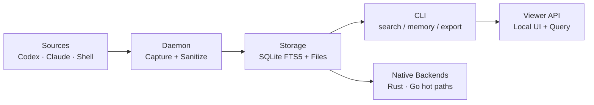
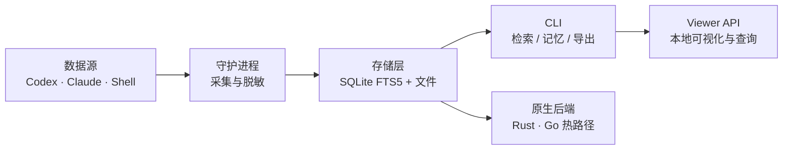

<p align="center">
  
</p>

<p align="center">
  <strong>Local-first context &amp; memory runtime for multi-agent AI coding teams.</strong><br>
  <em>面向多 Agent AI 编码团队的本地优先上下文与记忆运行时。</em>
</p>

<p align="center">
  <a href="https://github.com/dunova/ContextGO/actions/workflows/verify.yml"></a>
  <a href="https://codecov.io/gh/dunova/ContextGO"></a>
  <a href="https://github.com/dunova/ContextGO/releases/tag/v0.7.0"></a>
  <a href="https://pypi.org/project/contextgo/"></a>
  <a href="https://github.com/dunova/ContextGO/blob/main/LICENSE"></a>
</p>

---

ContextGO unifies Codex, Claude, and shell session histories into one **searchable, auditable index** stored entirely on your machine. No Docker. No MCP broker. No external vector database. Deploy in under five minutes on a bare machine.

---

## Quick Start

```bash
pip install contextgo
contextgo health
contextgo search "auth root cause" --limit 10
```

Or from source:

```bash
git clone https://github.com/dunova/ContextGO.git
cd ContextGO && bash scripts/unified_context_deploy.sh
python3 scripts/context_cli.py health
```

---

## Why ContextGO

| | ContextGO | Cursor Context | Continue.dev | Mem0 |
|---|:---:|:---:|:---:|:---:|
| Local-first by default | ✓ | Partial | Partial | ✗ |
| Docker-free | ✓ | ✓ | Partial | ✗ |
| Multi-agent session index | ✓ | ✗ | ✗ | Partial |
| Native Rust/Go scan | ✓ | ✗ | ✗ | ✗ |
| MCP-free by default | ✓ | ✗ | ✗ | ✗ |
| Built-in delivery validation | ✓ | ✗ | ✗ | ✗ |

---

## Architecture



**Stack:** Python (control plane) · Rust (`native/session_scan/`) · Go (`native/session_scan_go/`) · SQLite FTS5 (index)

---

## Commands

### Search

```bash
contextgo search "schema migration" --limit 10    # full-text keyword search
contextgo semantic "database design" --limit 5    # local-embedding semantic search
contextgo native-scan --backend auto --threads 4  # Rust/Go scanner directly
```

### Memory

```bash
contextgo save --title "Auth fix" --content "..." --tags auth,bug
contextgo export "" /tmp/export.json --limit 1000
contextgo import /tmp/export.json
```

### Operations

```bash
contextgo health                    # verify installation and storage integrity
contextgo smoke                     # run full smoke test suite
contextgo maintain --dry-run        # clean and repair local index
contextgo serve --port 37677        # start local viewer at 127.0.0.1:37677
```

---

## Configuration

All configuration is via environment variables. Defaults work out of the box.

| Variable | Default | Description |
|---|---|---|
| `CONTEXTGO_STORAGE_ROOT` | `~/.contextgo` | Root directory for all data |
| `CONTEXTGO_SESSION_INDEX_DB_PATH` | `$ROOT/index/session_index.db` | Session index SQLite path |
| `MEMORY_INDEX_DB_PATH` | `$ROOT/index/memory_index.db` | Memory index SQLite path |
| `CONTEXTGO_VIEWER_HOST` | `127.0.0.1` | Viewer bind address |
| `CONTEXTGO_VIEWER_PORT` | `37677` | Viewer TCP port |
| `CONTEXTGO_VIEWER_TOKEN` | _(empty)_ | Bearer token for non-loopback binding |
| `CONTEXTGO_ENABLE_REMOTE_MEMORY_HTTP` | `false` | Enable remote sync (disabled by default) |

Full reference: [docs/CONFIGURATION.md](docs/CONFIGURATION.md)

---

## For AI Agents

If you are Claude, Codex, Cursor, or any LLM-powered tool, see [AGENTS.md](AGENTS.md) for the full onboarding guide and tool manifest.

One-command deploy and verify:

```bash
git clone https://github.com/dunova/ContextGO.git \
  && cd ContextGO \
  && bash scripts/unified_context_deploy.sh \
  && python3 scripts/context_cli.py smoke
```

The [`.claude/CLAUDE.md`](.claude/CLAUDE.md) file is auto-read by Claude Code and documents all commands, style rules, and test gates.

---

## Project Structure

```
ContextGO/
├── scripts/                   # Python control plane
│   ├── context_cli.py         # Single entry point for all commands
│   ├── context_daemon.py      # Session capture and sanitization
│   ├── session_index.py       # SQLite FTS5 session index
│   ├── memory_index.py        # Memory and observation index
│   ├── context_server.py      # Local viewer API server
│   └── context_smoke.py       # Smoke test suite
├── native/
│   ├── session_scan/          # Rust hot-path binary
│   └── session_scan_go/       # Go parallel-scan binary
├── docs/                      # Architecture, config, troubleshooting
├── benchmarks/                # Python vs. native performance harness
└── templates/                 # launchd / systemd-user service templates
```

---

## Contributing

See [CONTRIBUTING.md](CONTRIBUTING.md) for local dev setup, test commands, and PR quality gates.

- [SECURITY.md](SECURITY.md) — threat model and responsible disclosure
- [CHANGELOG.md](CHANGELOG.md) — full version history
- [docs/ARCHITECTURE.md](docs/ARCHITECTURE.md) — component breakdown and design principles
- [docs/TROUBLESHOOTING.md](docs/TROUBLESHOOTING.md) — common failure modes

---

## License

Licensed under [AGPL-3.0](LICENSE). You may use, modify, and distribute ContextGO freely — any modifications distributed as a service must also be open-sourced under AGPL-3.0. Commercial licensing available; contact the maintainers.

Copyright 2025-2026 Dunova.

---
---

# 中文版

ContextGO 将 Codex、Claude 和 shell 的会话历史统一到一条**可检索、可追溯的索引**中，全部存储在本机。无需 Docker，无需 MCP 代理，无需外部向量数据库。裸机上五分钟内完成部署。

---

## 快速上手

```bash
pip install contextgo
contextgo health
contextgo search "认证根因" --limit 10
```

或从源码安装：

```bash
git clone https://github.com/dunova/ContextGO.git
cd ContextGO && bash scripts/unified_context_deploy.sh
python3 scripts/context_cli.py health
```

---

## 为什么选择 ContextGO

| | ContextGO | Cursor Context | Continue.dev | Mem0 |
|---|:---:|:---:|:---:|:---:|
| 默认本地优先 | ✓ | 部分 | 部分 | ✗ |
| 无需 Docker | ✓ | ✓ | 部分 | ✗ |
| 多 Agent 会话索引 | ✓ | ✗ | ✗ | 部分 |
| Rust/Go 原生扫描 | ✓ | ✗ | ✗ | ✗ |
| 默认无 MCP | ✓ | ✗ | ✗ | ✗ |
| 内置交付验证链 | ✓ | ✗ | ✗ | ✗ |

---

## 架构



**技术栈：** Python（控制层）· Rust（`native/session_scan/`）· Go（`native/session_scan_go/`）· SQLite FTS5（索引）

---

## 命令参考

### 检索

```bash
contextgo search "schema 迁移" --limit 10         # 全文关键词检索
contextgo semantic "数据库设计决策" --limit 5       # 本地向量语义检索
contextgo native-scan --backend auto --threads 4  # 直接调用原生扫描器
```

### 记忆

```bash
contextgo save --title "认证修复" --content "..." --tags auth,bug
contextgo export "" /tmp/export.json --limit 1000
contextgo import /tmp/export.json
```

### 运维

```bash
contextgo health                    # 验证安装状态与存储完整性
contextgo smoke                     # 执行完整 smoke 测试套件
contextgo maintain --dry-run        # 清理并修复本地索引
contextgo serve --port 37677        # 在 127.0.0.1:37677 启动本地 Viewer
```

---

## 配置

所有配置均通过环境变量完成，默认值开箱即用。

| 变量 | 默认值 | 说明 |
|---|---|---|
| `CONTEXTGO_STORAGE_ROOT` | `~/.contextgo` | 所有数据的根目录 |
| `CONTEXTGO_SESSION_INDEX_DB_PATH` | `$ROOT/index/session_index.db` | 会话索引 SQLite 路径 |
| `MEMORY_INDEX_DB_PATH` | `$ROOT/index/memory_index.db` | 记忆索引 SQLite 路径 |
| `CONTEXTGO_VIEWER_HOST` | `127.0.0.1` | Viewer 绑定地址 |
| `CONTEXTGO_VIEWER_PORT` | `37677` | Viewer TCP 端口 |
| `CONTEXTGO_VIEWER_TOKEN` | _（空）_ | 非回环地址绑定时的 Bearer token |
| `CONTEXTGO_ENABLE_REMOTE_MEMORY_HTTP` | `false` | 启用远程同步（默认关闭） |

完整参考：[docs/CONFIGURATION.md](docs/CONFIGURATION.md)

---

## 面向 AI Agent

如果你是 Claude、Codex、Cursor 或任何 LLM 驱动的工具，请参阅 [AGENTS.md](AGENTS.md) 获取完整接入指南和工具清单。

一键部署并验证：

```bash
git clone https://github.com/dunova/ContextGO.git \
  && cd ContextGO \
  && bash scripts/unified_context_deploy.sh \
  && python3 scripts/context_cli.py smoke
```

[`.claude/CLAUDE.md`](.claude/CLAUDE.md) 文件由 Claude Code 自动读取，包含所有命令说明、代码风格规范和测试门控。

---

## 参与贡献

见 [CONTRIBUTING.md](CONTRIBUTING.md) 了解本地开发环境、测试命令和 PR 质量门。

- [SECURITY.md](SECURITY.md) — 威胁模型与负责任披露
- [CHANGELOG.md](CHANGELOG.md) — 完整版本变更记录
- [docs/ARCHITECTURE.md](docs/ARCHITECTURE.md) — 组件概览与设计原则
- [docs/TROUBLESHOOTING.md](docs/TROUBLESHOOTING.md) — 常见故障与排查步骤

---

## 许可证

采用 [AGPL-3.0](LICENSE) 许可证。你可以自由使用、修改和分发 ContextGO——以服务形式分发修改版本时，需以同等条款开源。如需商业授权，请联系维护者。

Copyright 2025-2026 Dunova。
