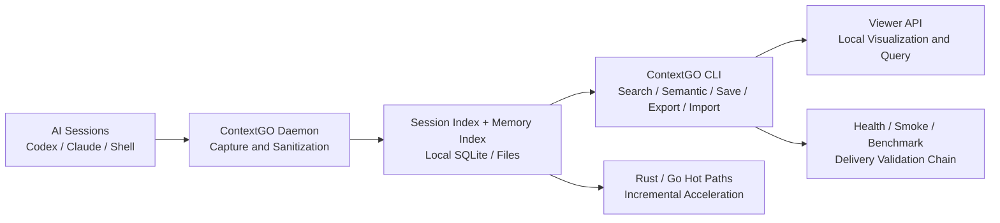
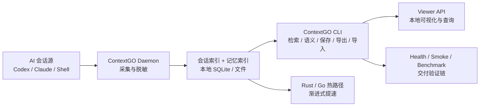

<!-- Project logo placeholder: place a 600x120 banner at docs/media/banner.png and uncomment the line below -->
<!-- <p align="center"></p> -->

# ContextGO

**Local-first context and memory runtime for multi-agent AI coding teams.**

**面向多 Agent AI 编码团队的本地优先上下文与记忆运行时。**

---

[](https://github.com/dunova/ContextGO/actions/workflows/verify.yml)
[](https://github.com/dunova/ContextGO/releases/tag/v0.7.0)
[](https://github.com/dunova/ContextGO/blob/main/LICENSE)
[](https://github.com/dunova/ContextGO/stargazers)
[](https://www.python.org/)
[](#quick-start)
[](#architecture)
[](#why-contextgo)

---

## English

### What is ContextGO?

ContextGO is a local-first context and memory runtime that unifies Codex, Claude, and shell session histories into one searchable, auditable chain — with no Docker, no MCP, and no external bridge required by default. It runs entirely on your machine, stores everything in local SQLite, and exposes a single CLI for search, memory management, and operational validation. Native hot paths in Rust and Go accelerate performance without changing the operator interface.

### Why ContextGO?

- **Local-first privacy.** All session data stays on your machine by default. No context leaves your trust boundary unless you explicitly configure remote sync.
- **Zero infrastructure.** No Docker. No MCP broker. No external vector database. Clone, deploy, and run in under five minutes on a bare machine.
- **Multi-agent ready.** Designed for teams running Codex, Claude, and shell agents in parallel. One searchable index across all agent histories.
- **Rust/Go performance.** Python handles the stable control plane. Rust and Go replace only the measured hot paths, delivering native scan speed without a full-stack rewrite.
- **Battle-tested delivery chain.** Ships with `health`, `smoke`, `benchmark`, and installed-runtime validation as first-class commands, not afterthoughts.

### Architecture



### Quick Start

**1. Clone the repository.**

```bash
git clone https://github.com/dunova/ContextGO.git
cd ContextGO
```

**2. Run the unified deploy script.** This installs dependencies, initializes the local storage root, and sets up service templates.

```bash
bash scripts/unified_context_deploy.sh
```

**3. Verify the installation with a health check.**

```bash
python3 scripts/context_cli.py health
```

**4. Run the smoke test to confirm the full command surface is working.**

```bash
python3 scripts/context_cli.py smoke
```

**5. Run your first search.**

```bash
python3 scripts/context_cli.py search "auth root cause" --limit 10
```

**6. Start the local viewer.**

```bash
python3 scripts/context_cli.py serve --host 127.0.0.1 --port 37677
```

### Core Commands

#### Search

| Command | Description | Example |
|---|---|---|
| `search QUERY` | Full-text keyword search across all indexed sessions | `python3 scripts/context_cli.py search "schema migration" --limit 10` |
| `semantic QUERY` | Semantic similarity search using local embeddings | `python3 scripts/context_cli.py semantic "database design decision" --limit 5` |
| `native-scan` | Run the Rust or Go native scanner directly | `python3 scripts/context_cli.py native-scan --backend auto --threads 4` |

#### Memory

| Command | Description | Example |
|---|---|---|
| `save` | Save a titled memory entry with optional tags | `python3 scripts/context_cli.py save --title "Auth fix" --content "..." --tags auth,bug` |
| `export` | Export indexed entries to a JSON file | `python3 scripts/context_cli.py export "" /tmp/export.json --limit 1000` |
| `import` | Import a previously exported JSON file | `python3 scripts/context_cli.py import /tmp/export.json` |

#### Server

| Command | Description | Example |
|---|---|---|
| `serve` | Start the local viewer API server | `python3 scripts/context_cli.py serve --host 127.0.0.1 --port 37677` |

#### Maintenance and Validation

| Command | Description | Example |
|---|---|---|
| `health` | Check installation state and storage integrity | `python3 scripts/context_cli.py health` |
| `smoke` | Run the full smoke test suite against a working copy | `python3 scripts/context_cli.py smoke` |
| `maintain` | Run cleanup and maintenance on the local index | `python3 scripts/context_cli.py maintain --dry-run` |

### Performance

- **Rust scanner** (`native/session_scan/`) delivers low-allocation file scanning on large directory trees with explicit error handling on every path operation.
- **Go parallel scanner** (`native/session_scan_go/`) uses concurrent directory walks and byte-slice snippet extraction to minimize heap allocations per result.
- **SQLite FTS5** backs the full-text search index with batched writes (per-100-row commit) that reduce write amplification by approximately 80% compared to per-row commits on large ingest loads.

### Project Structure

```text
ContextGO/
├── docs/                      # Architecture, release notes, troubleshooting, media guide
├── scripts/                   # Unified control plane: CLI, daemon, server, smoke, deploy
│   ├── context_cli.py         # Single operator entry point for all commands
│   ├── context_daemon.py      # Session capture and sanitization
│   ├── session_index.py       # SQLite-backed session index and retrieval
│   ├── memory_index.py        # Memory and observation index
│   ├── context_server.py      # Local viewer API server
│   ├── context_maintenance.py # Index cleanup and repair
│   ├── context_smoke.py       # Working-copy smoke tests
│   ├── context_healthcheck.sh # Installation-state health probe
│   └── unified_context_deploy.sh
├── native/
│   ├── session_scan/          # Rust hot path for file scanning
│   └── session_scan_go/       # Go hot path for parallel scanning
├── benchmarks/                # Python vs. native-wrapper performance harness
├── integrations/gsd/          # GSD and gstack workflow integration
├── artifacts/                 # Autoresearch outputs, test sets, QA reports
├── templates/                 # launchd and systemd-user service templates
├── examples/                  # Configuration examples
└── patches/                   # Compatibility notes
```

### Comparison

| Feature | ContextGO | Cursor Context | Continue.dev | Mem0 |
|---|---|---|---|---|
| Local-first by default | Yes | Partial | Partial | No |
| Docker-free | Yes | Yes | Partial | No |
| Multi-agent session index | Yes | No | No | Partial |
| Native Rust/Go speed | Yes | No | No | No |
| MCP-free by default | Yes | No | No | No |

### Contributing and Resources

- [CONTRIBUTING.md](CONTRIBUTING.md) — local development setup, test execution, PR quality gate
- [SECURITY.md](SECURITY.md) — threat model, trust boundary, responsible disclosure
- [CHANGELOG.md](CHANGELOG.md) — full version history
- [docs/ARCHITECTURE.md](docs/ARCHITECTURE.md) — component breakdown, data flow, design principles
- [docs/TROUBLESHOOTING.md](docs/TROUBLESHOOTING.md) — common failure modes and resolution steps
- [docs/RELEASE_NOTES_0.7.0.md](docs/RELEASE_NOTES_0.7.0.md) — 0.7.0 release notes

### License

AGPL-3.0. See [LICENSE](LICENSE) for details.

---

## 中文版

### ContextGO 是什么？

ContextGO 是一个本地优先的上下文与记忆运行时，将 Codex、Claude 和 shell 的会话历史统一到一条可检索、可追溯的主链中。默认无需 Docker、无需 MCP、无需外部桥接，所有数据存储在本机 SQLite 中，通过唯一 CLI 完成检索、记忆管理和运维验证。Rust 与 Go 热路径在不改变操作接口的前提下提升扫描性能。

### 为什么选择 ContextGO？

- **本地优先的隐私保障。** 所有会话数据默认留在本机，上下文不会离开你的信任边界，除非你主动配置远程同步。
- **零基础设施依赖。** 无 Docker，无 MCP 代理，无外部向量数据库。在一台裸机上克隆、部署、运行，五分钟之内可以完成。
- **多 Agent 就绪。** 专为同时运行 Codex、Claude、shell agent 的团队设计，所有 agent 历史共用一个可检索的统一索引。
- **Rust/Go 性能加速。** Python 负责稳定的控制层，Rust 与 Go 只替换经基准测试确认的热点路径，性能递增，不需要重写整套工作流。
- **经过验证的交付链。** `health`、`smoke`、`benchmark` 和已安装运行时验证是一等命令，不是事后补充的附件。

### 架构图



### 快速上手

**1. 克隆仓库。**

```bash
git clone https://github.com/dunova/ContextGO.git
cd ContextGO
```

**2. 执行统一部署脚本。** 该脚本安装依赖、初始化本地存储根目录并配置服务模板。

```bash
bash scripts/unified_context_deploy.sh
```

**3. 执行健康检查，验证安装状态。**

```bash
python3 scripts/context_cli.py health
```

**4. 执行 smoke 测试，确认完整命令面正常工作。**

```bash
python3 scripts/context_cli.py smoke
```

**5. 运行第一次检索。**

```bash
python3 scripts/context_cli.py search "认证根因" --limit 10
```

**6. 启动本地 Viewer。**

```bash
python3 scripts/context_cli.py serve --host 127.0.0.1 --port 37677
```

### 核心命令

#### 检索

| 命令 | 说明 | 示例 |
|---|---|---|
| `search QUERY` | 对所有已索引会话执行全文关键词检索 | `python3 scripts/context_cli.py search "schema 迁移" --limit 10` |
| `semantic QUERY` | 使用本地向量执行语义相似度检索 | `python3 scripts/context_cli.py semantic "数据库设计决策" --limit 5` |
| `native-scan` | 直接调用 Rust 或 Go 原生扫描器 | `python3 scripts/context_cli.py native-scan --backend auto --threads 4` |

#### 记忆

| 命令 | 说明 | 示例 |
|---|---|---|
| `save` | 保存一条带标题和标签的记忆条目 | `python3 scripts/context_cli.py save --title "认证修复" --content "..." --tags auth,bug` |
| `export` | 将已索引条目导出为 JSON 文件 | `python3 scripts/context_cli.py export "" /tmp/export.json --limit 1000` |
| `import` | 导入之前导出的 JSON 文件 | `python3 scripts/context_cli.py import /tmp/export.json` |

#### 服务

| 命令 | 说明 | 示例 |
|---|---|---|
| `serve` | 启动本地 Viewer API 服务 | `python3 scripts/context_cli.py serve --host 127.0.0.1 --port 37677` |

#### 维护与验证

| 命令 | 说明 | 示例 |
|---|---|---|
| `health` | 检查安装状态与存储完整性 | `python3 scripts/context_cli.py health` |
| `smoke` | 对工作副本执行完整 smoke 测试套件 | `python3 scripts/context_cli.py smoke` |
| `maintain` | 对本地索引执行清理与维护 | `python3 scripts/context_cli.py maintain --dry-run` |

### 性能

- **Rust 扫描器**（`native/session_scan/`）在大型目录树上实现低分配文件扫描，所有路径操作均有显式错误处理。
- **Go 并行扫描器**（`native/session_scan_go/`）使用并发目录遍历和字节切片 snippet 提取，最大限度减少每条结果的堆分配。
- **SQLite FTS5** 支撑全文检索索引，批量写入（每 100 行提交一次）相比逐行提交可将大批量入库的写放大降低约 80%。

### 目录结构

```text
ContextGO/
├── docs/                      # 架构、发布说明、故障排查、媒体规范
├── scripts/                   # 统一控制层：CLI、守护进程、服务、smoke、部署
│   ├── context_cli.py         # 所有命令的唯一操作入口
│   ├── context_daemon.py      # 会话采集与脱敏写盘
│   ├── session_index.py       # SQLite 会话索引与检索排序
│   ├── memory_index.py        # 记忆与 observation 索引
│   ├── context_server.py      # 本地 Viewer API 服务
│   ├── context_maintenance.py # 索引清理与修复
│   ├── context_smoke.py       # 工作副本 smoke 测试
│   ├── context_healthcheck.sh # 安装态健康探针
│   └── unified_context_deploy.sh
├── native/
│   ├── session_scan/          # Rust 文件扫描热路径
│   └── session_scan_go/       # Go 并行扫描热路径
├── benchmarks/                # Python 与 native-wrapper 性能基准
├── integrations/gsd/          # GSD 与 gstack 工作流对接
├── artifacts/                 # autoresearch 输出、测试集、QA 报告
├── templates/                 # launchd / systemd-user 服务模板
├── examples/                  # 配置样例
└── patches/                   # 兼容性补丁说明
```

### 对比

| 特性 | ContextGO | Cursor Context | Continue.dev | Mem0 |
|---|---|---|---|---|
| 默认本地优先 | 是 | 部分 | 部分 | 否 |
| 无需 Docker | 是 | 是 | 部分 | 否 |
| 多 Agent 会话索引 | 是 | 否 | 否 | 部分 |
| Rust/Go 原生性能 | 是 | 否 | 否 | 否 |
| 默认无 MCP | 是 | 否 | 否 | 否 |

### 参与贡献与相关资源

- [CONTRIBUTING.md](CONTRIBUTING.md) — 本地开发环境搭建、测试执行、PR 质量门标准
- [SECURITY.md](SECURITY.md) — 威胁模型、信任边界、负责任披露指南
- [CHANGELOG.md](CHANGELOG.md) — 完整版本变更记录
- [docs/ARCHITECTURE.md](docs/ARCHITECTURE.md) — 组件概览、数据流、设计原则
- [docs/TROUBLESHOOTING.md](docs/TROUBLESHOOTING.md) — 常见故障与排查步骤
- [docs/RELEASE_NOTES_0.7.0.md](docs/RELEASE_NOTES_0.7.0.md) — 0.7.0 发布说明

### 许可证

AGPL-3.0，详见 [LICENSE](LICENSE)。

---

## Star History

[](https://star-history.com/#dunova/ContextGO&Date)
