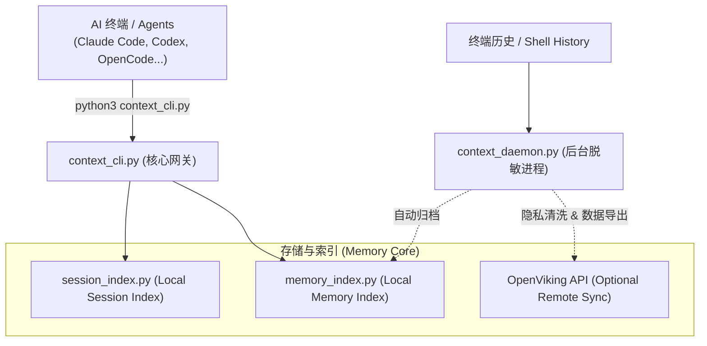
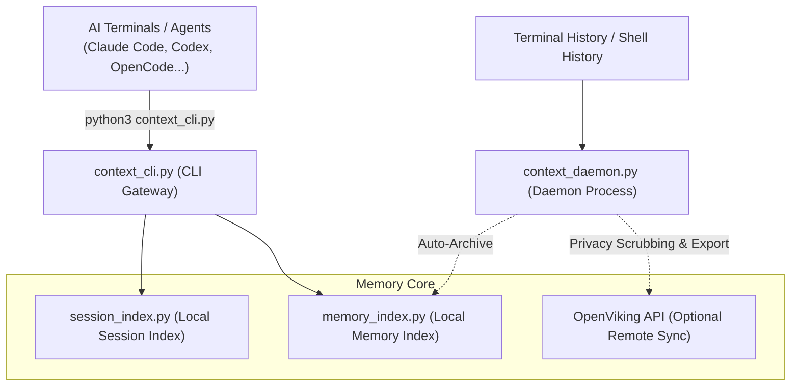

# Context Mesh Foundry

[中文版](#中文版) | [English](#english)

---

<a name="中文版"></a>
## 问题是什么

现代 AI 辅助开发会产生很多并行会话 — Claude Code、Codex CLI、OpenCode、终端 Shell… 每个都从零上下文开始。一个会话中的决策、调试历史和架构约束对下一个会话是不可见的，导致 AI 反复犯错或需要你重复重复喂背景。

## 这个项目做了什么

Context Mesh Foundry (CMF) 是一个**本地优先、无 MCP、零 Docker、单仓自包含**的上下文持久层。当前主链已经收敛为三个内置组件：

1. **session_index.py** — 仓库内置会话索引，直接扫描本机 AI / Shell 历史并建立本地 SQLite 检索库
2. **context_cli.py** — 统一 CLI，支持 `search / semantic / save / export / import / serve / maintain / health` — **默认入口**
3. **context_daemon.py** — canonical 后台守护入口，负责监控终端/AI 历史并将清洗后的内容导出到本地存储

### 🚀 零 Docker / 纯 Python 协议

与许多需要 Docker 运行复杂向量数据库（Milvus、Chroma）的上下文系统不同，CMF 设计为**服务器可选**：

- **默认模式**：完全作为本地 Python 脚本运行。使用仓库内置 `session_index.py` + `memory_index.py` 两套 SQLite 索引。无需 Docker，无需外部 recall/MCP 依赖。
- **高级模式（可选）**：如果你已经在运行 [OpenViking](https://github.com/Open-Wise/OpenViking) 服务器，CMF 仍可把本地记忆同步过去做远端语义增强；但默认主链不依赖它。

### 三段式预热协议（强制执行）

每个 AI 会话在执行任务前，应遵循以下检索顺序：

```
1. 本地 session index 精确检索 （必做，查找具体 session 或代码片段）
2. 本地语义检索               （仅精确检索未命中时，查找宽泛概念）
3. 代码库扫描            （最后手段，针对当前文件的定向扫描）
```

未经 `context_cli.py search` 预热就做全盘穷举扫描（如 `rg` 扫 `~/` 或 `/Volumes/*`）是**被禁止的**。

## 系统架构

```text
┌─────────────────────────────────────────────┐
│              AI 终端 / Agent                 │
│     (Claude Code, Codex CLI, OpenCode…)     │
└──────────────┬──────────────────────────────┘
               │ 调用 python3 context_cli.py
               ▼
┌─────────────────────────────────────────────┐
│          context_cli.py (CLI 入口)           │
│ • search / semantic / save / export / import│
│ • serve / maintain / health                 │
│ • 统一入口，legacy wrapper 仅作兼容          │
└──────────────┬──────────────────────────────┘
               │
       ┌───────┴───────┐
       ▼               ▼
┌────────────────┐  ┌─────────────────┐
│ session_index.py│  │  OpenViking API │
│ (本地会话索引)   │  │  (可选远端增强)  │
└────────────────┘  └─────────────────┘
       ▲
       │ 空闲时自动归档
┌──────┴──────────────────────────────────────┐
│          context_daemon.py (守护进程)        │
│ • 监控: Claude, Codex, OpenCode, Shell...  │
│ • 清洗: 15+ 种隐私/密钥脱敏模式              │
│ • 导出: 格式化 Markdown → 本地/远程存储      │
│ • 队列: 离线时自动存入 .pending/ 等待重试     │
└─────────────────────────────────────────────┘
```



### GSD 集成

与 [GSD 工作流](https://github.com/dunova/get-shit-done)（`discuss → plan → execute → verify`）配合使用时，每个阶段都会通过 `context_cli.py` 自动预热上下文：

- **discuss 阶段**: 强制执行 `context_cli.py search`。
- **plan 阶段**: 先 `search`，再按需 `semantic`。
- **health 阶段**: 通过 `context_healthcheck.sh` 监控系统运行状态。

## 模块地图

### 核心运行时 (Core Runtime)

| 脚本 | 用途 |
|--------|---------|
| `context_cli.py` | **默认统一入口** — 搜索、语义查询、保存、导入导出、viewer、maintenance、健康检查 |
| `session_index.py` | 仓库内置会话索引；主链搜索与健康检查的基础 |
| `context_daemon.py` | canonical daemon 入口；默认部署和 launchd/systemd 使用它 |
| `context_server.py` | canonical viewer/server 入口 |
| `viking_daemon.py` | 底层守护实现；默认由 `context_daemon.py` 入口调用 |
| `openviking_mcp.py` | legacy wrapper；实际归档实现位于 `scripts/legacy/` |
| `context_healthcheck.sh` | 针对整个 Context Mesh 主链的全面健康检查 |
| `start_openviking.sh` | legacy wrapper；实际 remote-sync/server 脚本位于 `scripts/legacy/` |
| `unified_context_deploy.sh` | 部署工具：安装 canonical runtime 到本地并注册服务 |
| `scf_context_prewarm.sh` | Shell 助手，用于在 GSD 动作执行前预热上下文 |

### 记忆管理 (Memory Tools)

| 脚本 | 用途 |
|--------|---------|
| `memory_index.py` | 本地记忆文件的索引、去重与元数据更新 |
| `memory_viewer.py` | viewer 实现模块；推荐通过 `context_cli.py serve` 启动 |
| `memory_hit_first_regression.py` | 回归测试套件，验证检索命中的准确度 |
| `export_memories.py` | legacy wrapper；推荐使用 `context_cli.py export` |
| `import_memories.py` | legacy wrapper；推荐使用 `context_cli.py import` |
| `start_memory_viewer.sh` | legacy wrapper；推荐使用 `context_cli.py serve` |

### 上下文优先策略 (Context-First Policy)

| 脚本 | 用途 |
|--------|---------|
| `apply_context_first_policy.sh` | 将 "询问上下文优先" 协议写入 AI 终端配置 |
| `verify_context_first_policy.sh` | 验证各终端是否严格执行该检索协议 |
| `e2e_quality_gate.py` | 端到端质量门禁，监控整个流水线的数据完整性 |
| `test_context_cli.py` | `context_cli.py` 的单元测试 |

### 辅助工具 (Utilities)

| 脚本 | 用途 |
|--------|---------|
| `context_maintenance.py` | canonical maintenance 入口；推荐通过 `context_cli.py maintain` 调用 |
| `onecontext_maintenance.py` | legacy wrapper；实际实现位于 `scripts/legacy/` |
| `run_onecontext_maintenance.sh` | legacy wrapper；转发到统一 CLI |
| `patch_openviking_semantic_processor.py` | legacy wrapper；实际补丁脚本位于 `scripts/legacy/` |

## 系统要求

- Python 3.10+
- macOS (launchd) 或 Linux (systemd)
- (可选) [OpenViking](https://github.com/Open-Wise/OpenViking) 服务器，仅在你需要远端同步时使用

## 快速开始

### 1. 克隆仓库

```bash
git clone https://github.com/dunova/context-mesh-foundry.git
cd context-mesh-foundry
```

### 2. 环境配置

```bash
cp .env.example .env
# 编辑 .env — 设置 OPENVIKING_URL、存储路径等
```

### 3a. 部署 (macOS)

```bash
bash scripts/unified_context_deploy.sh
```

### 4. 验证运行状态

```bash
python3 scripts/context_cli.py health
```

### 5. 开始使用

```bash
# 跨所有 AI 终端历史进行精确搜索
python3 scripts/context_cli.py search "身份验证 bug" --type all --limit 20 --literal

# 语义检索
python3 scripts/context_cli.py semantic "数据库配置决策" --limit 5

# 导出 / 导入索引记忆
python3 scripts/context_cli.py export "" /tmp/cmf-export.json --limit 1000
python3 scripts/context_cli.py import /tmp/cmf-export.json

# 启动本地 viewer
python3 scripts/context_cli.py serve --host 127.0.0.1 --port 37677
```

## 性能基准与原生原型

```bash
# Python 主链基准
python3 benchmarks/session_index_benchmark.py

# Rust 会话扫描原型
cd native/session_scan
CARGO_TARGET_DIR=/tmp/context_mesh_target cargo run --release -- --threads 4
```

当前策略不是先整体重写，而是先把 Python 主链收敛成干净单体，再对热点模块做渐进式原生替换。

## 守护进程工作原理

1. **自动发现**: 扫描 Claude Code、Codex、OpenCode、Kilo 以及普通的 Shell 历史 (zsh/bash)。
2. **实时增量读取**: 使用 inode 感知的游标检测文件新增行、轮转或截断。
3. **脱敏清洗**: 自动剔除 API 密钥、Token、密码、AWS 密钥、Slack 令牌和 PEM 私钥块。
4. **延迟自动归档**: 空闲 5 分钟后自动生成 Markdown 摘要并存入本地存储。
5. **重试机制**: 服务器离线时自动存入 `.pending/` 等待后续补录。
6. **自适应能效**: 智能调节扫描频率，静默期（如夜间）自动降频。

## 目录结构

```
context-mesh-foundry/
├── scripts/
│   ├── context_cli.py                # 默认 CLI 入口
│   ├── context_daemon.py             # canonical daemon entrypoint
│   ├── viking_daemon.py              # daemon implementation
│   ├── ...                           # 其他子工具
├── templates/
│   ├── launchd/                      # macOS 服务模板
│   └── systemd-user/                 # Linux 服务模板
├── ...
└── .env.example                      # 环境变量模板
```

## 安全与隐私

守护进程在本地通过正则表达式强行拦截并剔除 API 密钥、密码、私钥等 15 种敏感信息。数据目录默认为 `chmod 700`，生成的 Markdown 记忆文件为 `chmod 600`。

## 环境变量

具体配置项见 [`.env.example`](.env.example)。

## 许可证

[GPL-3.0](LICENSE)

---

<a name="english"></a>
## The Problem

Modern AI-assisted development spawns many parallel sessions — Claude Code, Codex CLI, OpenCode, terminal shells… Each starts with zero context. Decisions, debugging history, and architectural constraints from one session are invisible to the next, causing AI to hallucinate or require redundant prompting.

## What This Does

Context Mesh Foundry (CMF) is a **local-first, MCP-free, zero-Docker, self-contained** context persistence layer. The mainline now converges around three built-in components:

1. **session_index.py** — built-in local session index that scans AI / shell histories into SQLite
2. **context_cli.py** — unified CLI for `search / semantic / save / export / import / serve / maintain / health` — the **default entry point**
3. **context_daemon.py** — canonical daemon entrypoint that watches terminal/AI histories and exports sanitized markdown to local storage

### 🚀 Zero-Docker / Pure-Python Operation

Unlike many context systems that require complex vector databases (Milvus, Chroma) running in Docker, CMF is designed to be **server-optional**:

- **Default Mode**: Operates entirely as local Python scripts using built-in `session_index.py` + `memory_index.py`. No Docker, no external recall/MCP dependency.
- **Advanced Mode (Optional)**: If you already run [OpenViking](https://github.com/Open-Wise/OpenViking), CMF can still sync local memories there for remote semantic enhancement, but the mainline does not require it.

### Hit-First Retrieval Protocol

Every AI session should follow this order before doing any work:

```
1. Local session-index exact search   (mandatory: check specific sessions or snippets)
2. Local semantic search              (only if exact search misses: check broad concepts)
3. Codebase scan          (only as last resort: targeted local scan)
```

Blind whole-disk scans (`~/`, `/Volumes/*`) without prior `context_cli.py search` are **forbidden**.

## Architecture

```text
┌─────────────────────────────────────────────┐
│              AI Terminals / Agents           │
│     (Claude Code, Codex CLI, OpenCode…)     │
└──────────────┬──────────────────────────────┘
               │ call python3 context_cli.py
               ▼
┌─────────────────────────────────────────────┐
│          context_cli.py (CLI Gateway)       │
│ • search / semantic / save / export / import│
│ • serve / maintain / health                 │
│ • Unified entry; legacy wrappers stay thin  │
└──────────────┬──────────────────────────────┘
               │
       ┌───────┴───────┐
       ▼               ▼
┌──────────────────┐  ┌─────────────────┐
│ session_index.py │  │  OpenViking API │
│ (local sessions) │  │ (optional sync) │
└──────────────────┘  └─────────────────┘
       ▲
       │  auto-export on idle
┌──────┴──────────────────────────────────────┐
│           context_daemon.py (Daemon)        │
│   • Watches: Claude, Codex, OpenCode,       │
│     Kilo, zsh/bash, Gemini walkthroughs     │
│   • Sanitizes: 15+ redaction patterns       │
│   • Exports: markdown → local storage       │
│   • Queues failures to .pending/            │
└─────────────────────────────────────────────┘
```



### GSD Integration

When used with the [GSD workflow](https://github.com/dunova/get-shit-done) (`discuss → plan → execute → verify`), each phase auto-preheats context via `context_cli.py`:

- **discuss-phase**: mandatory `context_cli.py search`
- **plan-phase**: `search` + optional `semantic`
- **health**: stack-wide diagnostics via `context_healthcheck.sh`

## Module Map

### Core Runtime

| Script | Purpose |
|--------|---------|
| `context_cli.py` | **Default unified entry point** — search, semantic, save, import/export, viewer, maintenance, health |
| `session_index.py` | Built-in session index powering standalone search and health |
| `context_daemon.py` | Canonical daemon entrypoint used by deployment and services |
| `context_server.py` | Canonical viewer/server entrypoint |
| `viking_daemon.py` | Low-level daemon implementation invoked by `context_daemon.py` |
| `openviking_mcp.py` | legacy wrapper; archived implementation lives under `scripts/legacy/` |
| `context_healthcheck.sh` | Comprehensive health checks for the standalone stack |
| `start_openviking.sh` | legacy wrapper; archived remote-sync/server bootstrap lives under `scripts/legacy/` |
| `unified_context_deploy.sh` | Deploy canonical runtime locally and register services |
| `scf_context_prewarm.sh` | Shell helper for context warmup before GSD actions |

### Memory Tools

| Script | Purpose |
|--------|---------|
| `memory_index.py` | Local memory indexing and deduplication |
| `memory_viewer.py` | Viewer implementation; prefer `context_cli.py serve` |
| `memory_hit_first_regression.py` | Regression suite for retrieval quality |
| `export_memories.py` | Legacy wrapper; prefer `context_cli.py export` |
| `import_memories.py` | Legacy wrapper; prefer `context_cli.py import` |
| `start_memory_viewer.sh` | Legacy wrapper; prefer `context_cli.py serve` |

### Context-First Policy

| Script | Purpose |
|--------|---------|
| `apply_context_first_policy.sh` | Apply Context-First protocol to AI tool configs |
| `verify_context_first_policy.sh` | Verify all terminals follow the protocol |
| `e2e_quality_gate.py` | End-to-end quality gate for context pipeline |
| `test_context_cli.py` | Unit tests for context_cli.py |

### Utilities

| Script | Purpose |
|--------|---------|
| `context_maintenance.py` | canonical maintenance entrypoint; prefer `context_cli.py maintain` |
| `onecontext_maintenance.py` | legacy wrapper; archived implementation lives under `scripts/legacy/` |
| `run_onecontext_maintenance.sh` | Legacy wrapper forwarding to unified CLI |
| `patch_openviking_semantic_processor.py` | legacy wrapper; archived patch helper lives under `scripts/legacy/` |

## Requirements

- Python 3.10+
- macOS (launchd) or Linux (systemd)
- (Optional) [OpenViking](https://github.com/Open-Wise/OpenViking) server, only for remote sync/enhancement

## Quick Start

### 1. Clone

```bash
git clone https://github.com/dunova/context-mesh-foundry.git
cd context-mesh-foundry
```

### 2. Configure

```bash
cp .env.example .env
# Edit .env — set OPENVIKING_URL, storage paths
```

### 3a. Deploy (macOS)

```bash
bash scripts/unified_context_deploy.sh
```

### 4. Verify

```bash
python3 scripts/context_cli.py health
```

### 5. Use

```bash
# Search across all AI session histories
python3 scripts/context_cli.py search "authentication bug" --type all --limit 20 --literal

# Semantic search
python3 scripts/context_cli.py semantic "database decisions" --limit 5

# Export / import indexed memories
python3 scripts/context_cli.py export "" /tmp/cmf-export.json --limit 1000
python3 scripts/context_cli.py import /tmp/cmf-export.json

# Start local viewer
python3 scripts/context_cli.py serve --host 127.0.0.1 --port 37677
```

## Benchmarks And Native Prototype

```bash
# Python mainline benchmark
python3 benchmarks/session_index_benchmark.py

# Rust session-scan prototype
cd native/session_scan
CARGO_TARGET_DIR=/tmp/context_mesh_target cargo run --release -- --threads 4
```

The strategy is not to rewrite everything first. We first converge the Python mainline into a clean monolith, then replace hot paths incrementally.

## How the Daemon Works

1. **Auto-Discovery**: Scans Claude, Codex CLI, OpenCode, Kilo, and Shells (zsh/bash).
2. **Inode Tracking**: Efficiently tails files even if rotated or truncated.
3. **Privacy Scrubbing**: Uses 15+ regex patterns to redact API keys, tokens, and passwords.
4. **Idle Archival**: Automatically exports summaries to local storage after 5m idle.
5. **Fail-safe Queuing**: Retries failed remote exports via `.pending/` directory.
6. **Adaptive Polling**: Saves CPU by throttling when idle or at night.

## Repository Layout

```
context-mesh-foundry/
├── scripts/
│   ├── context_cli.py                # Default CLI entry point
│   ├── context_daemon.py             # Canonical daemon entrypoint
│   ├── viking_daemon.py              # Daemon implementation
│   ├── legacy/                       # Archived compatibility implementations
│   ├── context_healthcheck.sh        # Health checks
│   ├── unified_context_deploy.sh     # Deploy & sync
│   ├── ...
├── templates/
│   ├── launchd/                      # macOS plists
│   └── systemd-user/                 # Linux services
├── ...
└── .env.example                      # ENV template
```

## Security

Scans for secrets on push and redacts sensitive data (API keys, tokens, AWS keys) before archival. Data directories use strict `chmod 700` permissions.

## Environment Variables

See [`.env.example`](.env.example) for all configurable variables.

## License

[GPL-3.0](LICENSE)
