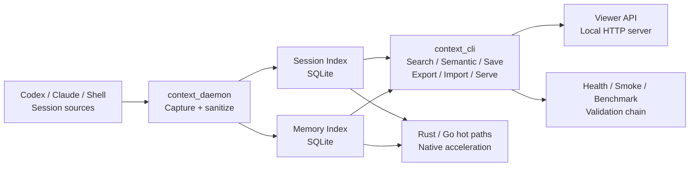

# ContextGO Architecture

## Overview

ContextGO is a local-first context and memory runtime for multi-agent AI coding teams. It captures terminal and agent session history, indexes it locally, and exposes a unified CLI for search, semantic recall, memory management, and health validation.

The design follows a single-operator surface: one CLI, one daemon, one storage root, one validation chain. All default paths run without external services, Docker, or MCP.

## System Diagram



## Data Flow

1. **Capture** - `context_daemon` reads terminal histories (`~/.zsh_history`, `~/.bash_history`) and agent session directories (`~/.codex/sessions/`, `~/.claude/projects/`). Raw content passes through a `<private>` sanitization filter before being written to the storage root.

2. **Index** - `session_index` and `memory_index` build and maintain SQLite indexes under `~/.contextgo/index/`. These indexes are the single source of truth for all retrieval.

3. **Retrieval** - `context_cli` runs exact search, semantic search, save, export, import, and health commands against the local indexes. `context_server` serves a local viewer API on `127.0.0.1` only.

4. **Validation** - `context_healthcheck.sh`, `context_smoke.py`, `smoke_installed_runtime.py`, and `benchmarks/run.py` form the delivery validation chain. They verify end-to-end operation without any remote dependencies.

## Directory Structure

```text
ContextGO/
├── docs/                      # Architecture, release, troubleshooting, config docs
├── scripts/                   # Primary control plane
│   ├── context_cli.py         # Canonical CLI entry point
│   ├── context_daemon.py      # Session capture and sanitization
│   ├── session_index.py       # Session index and retrieval
│   ├── memory_index.py        # Memory / observation index
│   ├── context_server.py      # Viewer HTTP server
│   ├── context_config.py      # Storage root and environment config
│   ├── context_core.py        # Shared core logic
│   ├── context_maintenance.py # Cleanup and maintenance
│   ├── context_smoke.py       # Working-copy smoke test
│   ├── smoke_installed_runtime.py  # Installed-runtime smoke test
│   ├── e2e_quality_gate.py    # End-to-end quality gate
│   ├── context_healthcheck.sh # Shell health check
│   └── unified_context_deploy.sh   # Deployment script
├── native/
│   ├── session_scan/          # Rust hot-path prototype
│   └── session_scan_go/       # Go hot-path prototype
├── benchmarks/                # Python and native benchmark harness
├── integrations/gsd/          # GSD / gstack workflow integrations
├── artifacts/                 # Autoresearch results, test sets, QA reports
├── templates/                 # launchd / systemd-user service templates
├── examples/                  # Configuration templates
└── patches/                   # Compatibility patch notes
```

## Component Reference

| Component | File | Role |
|---|---|---|
| CLI | `scripts/context_cli.py` | Canonical entry point for all user-facing commands |
| Daemon | `scripts/context_daemon.py` | Background session capture with sanitization |
| Session Index | `scripts/session_index.py` | SQLite session index build and query |
| Memory Index | `scripts/memory_index.py` | SQLite memory and observation index |
| Config | `scripts/context_config.py` | Storage root resolution and env variable helpers |
| Core | `scripts/context_core.py` | Shared logic used by CLI and daemon |
| Server | `scripts/context_server.py` | Local HTTP viewer (loopback only) |
| Maintenance | `scripts/context_maintenance.py` | Index cleanup and repair |
| Smoke | `scripts/context_smoke.py` | Working-copy end-to-end smoke test |
| Installed Smoke | `scripts/smoke_installed_runtime.py` | Smoke test against the installed runtime |
| Quality Gate | `scripts/e2e_quality_gate.py` | End-to-end integration quality gate |
| Health Check | `scripts/context_healthcheck.sh` | Shell script health probe |
| Benchmarks | `benchmarks/run.py` | Performance benchmark harness |
| Rust hot path | `native/session_scan/` | Rust prototype for parallel session scanning |
| Go hot path | `native/session_scan_go/` | Go prototype for lightweight binary scanning |

## Layer Summary

| Layer | Location | Purpose |
|---|---|---|
| Control plane | `scripts/` | All CLI, daemon, server, and maintenance logic |
| Storage | `~/.contextgo/` | Default storage root for indexes and raw data |
| Native acceleration | `native/` | Opt-in Rust/Go hot-path replacements |
| Performance truth | `benchmarks/` | Reproducible benchmark suite |
| Evaluation memory | `artifacts/` | QA reports and autoresearch outputs |
| Deployment | `templates/` | Service manager templates for launchd and systemd |

## Design Principles

**Local first.** The default runtime has no external service dependencies. All indexes and data live under the storage root (`~/.contextgo` by default).

**Single operator surface.** Users interact only with `context_cli`, `context_daemon`, `context_server`, and `context_maintenance`. There is no secondary CLI or alternate entry point.

**Monolith by default.** The default execution path exposes a single `ContextGO` surface. Complexity is contained inside, not spread across multiple services.

**Validation as a first-class requirement.** Every change must pass `context_smoke.py`, `smoke_installed_runtime.py`, and the benchmark harness. Health and performance are not optional.

**Progressive native acceleration.** The Python control plane is the stable delivery surface. Rust and Go replace only identified hot paths, driven by benchmark data, without changing the operator interface.

## Storage Root

The storage root defaults to `~/.contextgo` and can be overridden with the `CONTEXTGO_STORAGE_ROOT` environment variable.

```
~/.contextgo/
├── index/
│   ├── session_index.db
│   └── memory_index.db
└── raw/
    └── (captured session data)
```

See [CONFIGURATION.md](CONFIGURATION.md) for the full list of environment variables.

## Installed Runtime Path

The default installed runtime location is `~/.local/share/contextgo/scripts`. The installed smoke test (`smoke_installed_runtime.py`) expects at minimum:

- `context_cli.py`
- `e2e_quality_gate.py`
- `context_healthcheck.sh`
- `benchmarks/run.py`

This path can be overridden with `CONTEXTGO_INSTALL_ROOT`.
