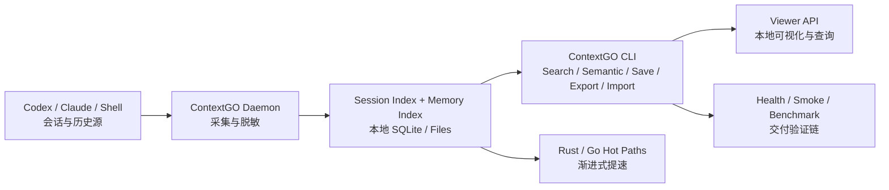
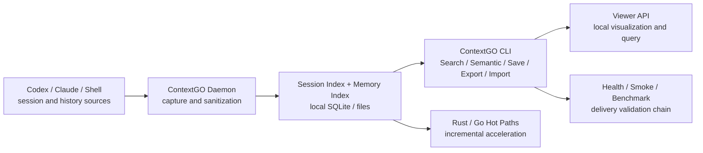

# ContextGO 架构 / ContextGO Architecture

## 中文版

### 架构图



### 架构树

```text
ContextGO/
├── docs/                      # 架构、发布、故障排查、商业交付文档
├── scripts/                   # 单体主链：CLI / daemon / server / smoke / health / deploy
│   ├── context_cli.py         # 搜索、语义、记忆、viewer、smoke 的唯一入口
│   ├── context_daemon.py      # 会话采集与脱敏写盘
│   ├── session_index.py       # 会话索引与检索排序
│   ├── memory_index.py        # 记忆 / observation 索引
│   ├── context_server.py      # viewer 服务入口
│   ├── context_maintenance.py # 清理、修复、维护
│   ├── context_smoke.py       # 工作副本 smoke
│   ├── context_healthcheck.sh # 健康检查
│   └── unified_context_deploy.sh
├── native/
│   ├── session_scan/          # Rust 热路径
│   └── session_scan_go/       # Go 热路径
├── benchmarks/                # Python / native-wrapper 基准
├── integrations/gsd/          # GSD / gstack 对接
├── artifacts/                 # autoresearch 结果、测试集、QA 报告
├── templates/                 # launchd / systemd-user 模板
├── examples/                  # 配置模板
└── patches/                   # 兼容补丁说明
```

### 组件概览

1. **采集层**  
   `scripts/context_daemon.py` 负责收集终端会话、shell 历史并在写入前完成 `<private>` 过滤。

2. **索引层**  
   `scripts/session_index.py` 与 `scripts/memory_index.py` 负责本地 SQLite / 文件索引。

3. **检索与服务层**  
   `scripts/context_cli.py` 是唯一 canonical CLI，承载 `health / search / semantic / save / export / import / serve / maintain`。

4. **运维验证层**  
   `scripts/context_healthcheck.sh`、`scripts/context_smoke.py`、`scripts/smoke_installed_runtime.py` 与 `benchmarks/run.py` 组成统一验证链。

### 数据流

1. 终端与 agent 历史由 `context_daemon` 采集并脱敏。  
2. 数据写入本地 storage root（默认 `~/.contextgo`）。  
3. `session_index` 与 `memory_index` 构建索引。  
4. `context_cli` 统一执行检索、导入导出、health、smoke 与 native 调用。  
5. `context_server` 提供本地 viewer API。  

### 设计原则

- **本地优先**：默认无外部桥接、无 Docker、无远程 recall 依赖  
- **统一入口**：用户始终只面对一套 CLI  
- **默认单体**：复杂度尽量收在内部，而不是拆散到多服务  
- **验证前置**：任何变更都要过 `health / smoke / benchmark`  
- **渐进提速**：Python 保稳，Rust / Go 替换热点  

## English Version

### Architecture Diagram



### Architecture Tree

```text
ContextGO/
├── docs/                  # product, release, troubleshooting docs
├── scripts/               # unified control plane: CLI / daemon / smoke / deploy
├── native/                # Rust and Go hot paths
├── benchmarks/            # Python vs native-wrapper performance truth
├── integrations/gsd/      # workflow integration
├── artifacts/             # autoresearch outputs, testsets, QA reports
├── templates/             # launchd / systemd-user templates
├── examples/              # configuration examples
└── patches/               # compatibility notes
```

### Component Summary

1. `context_daemon.py` captures and sanitizes histories  
2. `session_index.py` and `memory_index.py` build the local retrieval layer  
3. `context_cli.py` is the single operator-facing entry point  
4. `context_server.py` exposes the local viewer API  
5. `context_smoke.py`, `context_healthcheck.sh`, and `benchmarks/run.py` form the validation chain  

### Data Flow

1. histories are captured and sanitized locally  
2. data is written into the local storage root  
3. indexes are built on top of SQLite and files  
4. the CLI executes retrieval, export/import, health, smoke, and native commands  
5. the viewer API exposes the local surface for inspection  

### Design Principles

- local-first by default  
- one CLI, one trust boundary, one validation chain  
- MCP-free by default  
- gradual Rust/Go acceleration instead of a full-stack rewrite  
