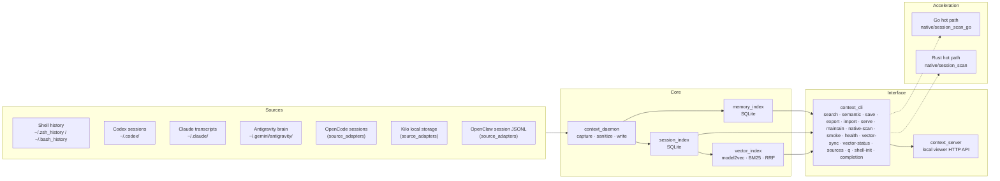
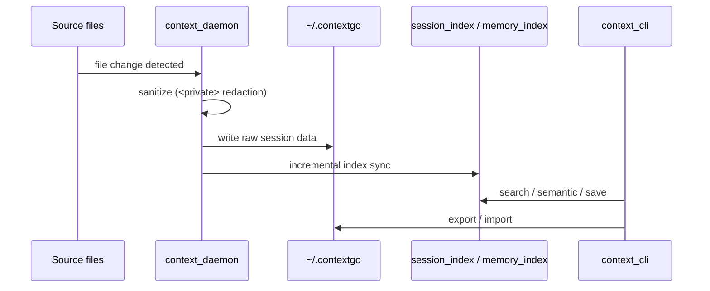

# Architecture / 架构

> [CONFIGURATION.md](CONFIGURATION.md) · [API.md](API.md) · [TROUBLESHOOTING.md](TROUBLESHOOTING.md) · [../CONTRIBUTING.md](../CONTRIBUTING.md)

## Overview / 概览

ContextGO is a local-first context and memory runtime for multi-agent AI coding teams. All data stays on disk; no external services are required.

ContextGO 是面向多智能体 AI 编码团队的本地优先上下文与记忆运行时。所有数据驻留本地，无需任何外部服务。

---

## System Diagram / 系统架构图



Dashed arrows indicate optional native acceleration; the Python path is always available as a fallback.

虚线箭头表示可选的 native 加速；Python 路径始终作为后备可用。

---

## Repository Layout / 代码结构

```text
ContextGO/
├── src/contextgo/             # Runtime package
│   ├── context_cli.py         # Single canonical entry point
│   ├── context_daemon.py      # Session capture and sanitization
│   ├── context_config.py      # Env var resolution and storage root
│   ├── session_index.py       # SQLite session index
│   ├── memory_index.py        # Memory / observation index
│   ├── context_core.py        # Shared helpers
│   ├── context_native.py      # Rust / Go backend orchestration
│   ├── context_server.py      # Viewer server entry point
│   ├── memory_viewer.py       # HTTP handler implementation
│   ├── context_maintenance.py # Index cleanup and repair
│   ├── context_smoke.py       # Smoke test suite
│   ├── source_adapters.py     # External tool auto-discovery + normalization
│   ├── vector_index.py        # Hybrid semantic search (model2vec + BM25 + RRF)
│   └── sqlite_retry.py        # Shared SQLite retry helpers (exponential backoff)
├── tests/                     # Full automated test suite
├── scripts/                   # Compatibility wrappers + operational scripts
├── native/
│   ├── session_scan/          # Rust hot-path binary
│   └── session_scan_go/       # Go hot-path binary
├── benchmarks/                # Python vs. native performance harness
├── config/                    # Runtime config files (noise_markers.json)
├── templates/                 # launchd / systemd-user service templates
├── examples/                  # Configuration templates
├── docs/                      # Documentation + current release notes
└── integrations/gsd/          # GSD / gstack workflow integration
```

---

## Component Layers / 组件层次

### 1. Capture layer / 采集层

`context_daemon.py` monitors shell history files, Codex sessions, Claude transcripts, and Antigravity brain directories. Before writing to disk, it applies `<private>` redaction to strip sensitive content. `source_adapters.py` provides normalized ingestion for additional platforms — OpenCode session databases, Kilo local storage, and OpenClaw session JSONL roots — without requiring manual reconfiguration when new tools are installed.

`context_daemon.py` 监控 shell 历史、Codex 会话、Claude 转录文件与 Antigravity brain 目录。写入前执行 `<private>` 脱敏。`source_adapters.py` 为额外平台提供规范化摄取——OpenCode 会话数据库、Kilo 本地存储、OpenClaw 会话 JSONL 根目录——安装新工具后无需手动重新配置。

### 2. Index layer / 索引层

`session_index.py` and `memory_index.py` maintain two independent SQLite databases under the storage root (`~/.contextgo/index/`). Session entries and memory observations are indexed separately to keep query paths clean. Search uses FTS5 full-text search (BM25 ranked) as the primary path, with LIKE-based queries as an automatic fallback when the SQLite build does not include FTS5. WAL mode is enabled for concurrent access resilience.

`session_index.py` 与 `memory_index.py` 在存储根目录下分别维护两个独立的 SQLite 数据库。会话条目与记忆观测分库存储，保持查询路径清晰。搜索以 FTS5 全文检索（BM25 排序）为首选路径，当 SQLite 构建不支持 FTS5 时自动降级为基于 LIKE 的查询。启用 WAL 模式提升并发访问韧性。

### 2a. Vector index layer / 向量索引层

`vector_index.py` provides an optional hybrid search engine gated by `CONTEXTGO_EXPERIMENTAL_SEARCH_BACKEND=vector`. It combines dense vector embeddings (model2vec `potion-base-8M`, 256-dim) with BM25 keyword scoring, fused via Reciprocal Rank Fusion (RRF, k=60). Results are stored in a separate `vector_index.db` SQLite database. The index degrades gracefully to LIKE-based search when `model2vec` is absent.

`vector_index.py` 提供可选的混合搜索引擎，由 `CONTEXTGO_EXPERIMENTAL_SEARCH_BACKEND=vector` 开关控制。结合稠密向量嵌入（model2vec `potion-base-8M`，256 维）与 BM25 关键词评分，通过倒数排名融合（RRF，k=60）合并结果。索引存储于独立的 `vector_index.db` SQLite 数据库。缺少 `model2vec` 时自动降级为基于 LIKE 的搜索。

### 3. Interface layer / 接口层

`context_cli.py` is the single operator entry point. It exposes sixteen subcommands:

`context_cli.py` 是唯一的操作入口，提供以下十六个子命令：

| Subcommand | Purpose / 用途 |
|---|---|
| `health` | Index status and sync / 索引状态与同步 |
| `search` | Keyword search / 关键词全文搜索 |
| `semantic` | Semantic / embedding-backed search / 语义搜索 |
| `save` | Write a memory observation / 写入记忆观测 |
| `export` | Export observations to JSON / 导出观测为 JSON |
| `import` | Import observations from JSON / 从 JSON 导入观测 |
| `serve` | Start the local viewer server / 启动本地 viewer 服务 |
| `maintain` | Index cleanup and repair / 索引清理与修复 |
| `native-scan` | Run native Rust/Go scan backend directly / 直接调用原生扫描后端 |
| `smoke` | Run end-to-end smoke gate / 运行端到端 smoke 验证 |
| `vector-sync` | Embed pending session documents into vector index / 向量嵌入待处理会话文档 |
| `vector-status` | Show vector index statistics / 显示向量索引统计 |
| `sources` | Show detected source platforms and adapter status / 显示已探测平台与 adapter 状态 |
| `q` | Quick recall — search or session ID lookup / 快速召回 — 搜索或会话 ID 查询 |
| `shell-init` | Print shell integration script / 打印 shell 集成脚本 |
| `completion` | Print shell completion script (bash/zsh/fish) / 打印 shell 补全脚本 |

`context_server.py` and `memory_viewer.py` implement the local HTTP viewer API (see [API.md](API.md)).

### 4. Native acceleration layer / native 加速层

`context_native.py` orchestrates optional Rust and Go binaries for hot-path file scanning. Both are transparent drop-in replacements for the Python scanner; the CLI contract does not change.

`context_native.py` 调度可选的 Rust / Go 二进制文件加速热点文件扫描，对 CLI 接口完全透明。

---

## Data Flow / 数据流



---

## Design Principles / 设计原则

| Principle | Description / 说明 |
|---|---|
| **Local-first** | No external bridges, no Docker, no remote recall dependency by default / 默认无外部依赖 |
| **Single entry point** | One CLI surface for all operations / 所有操作统一入口 |
| **Monolith by default** | Complexity contained internally, not split across services / 复杂度内聚而非外散 |
| **Validation-gated** | Every change passes `health → smoke → benchmark` before merge / 变更必须过验证链 |
| **Gradual acceleration** | Python provides stability; Rust/Go replace hot paths without changing the CLI contract / 渐进提速，不改接口 |
